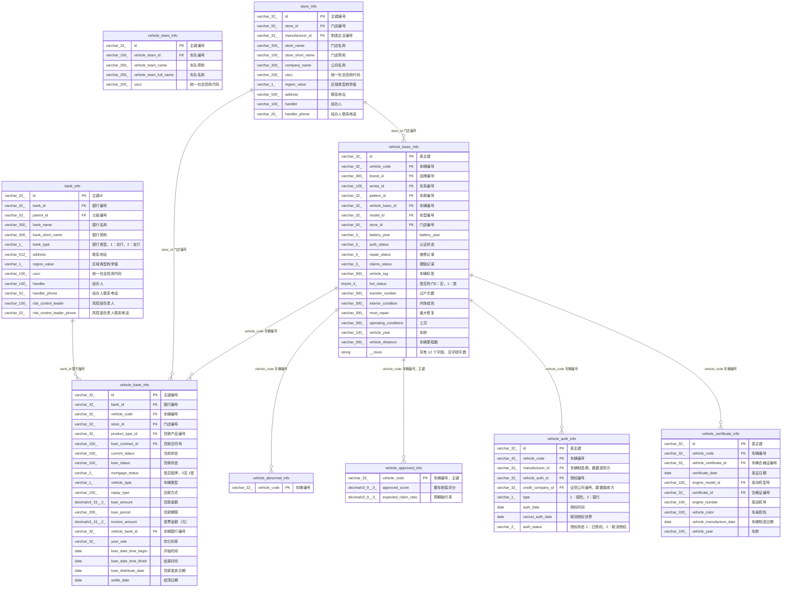
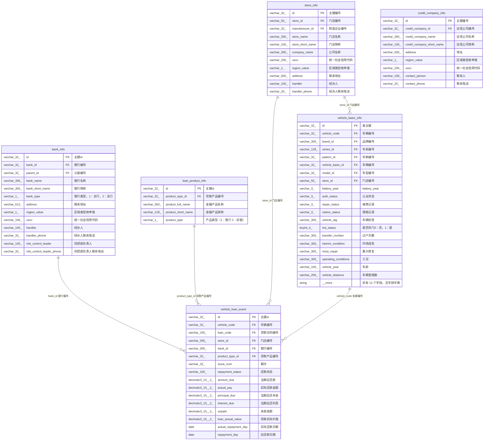
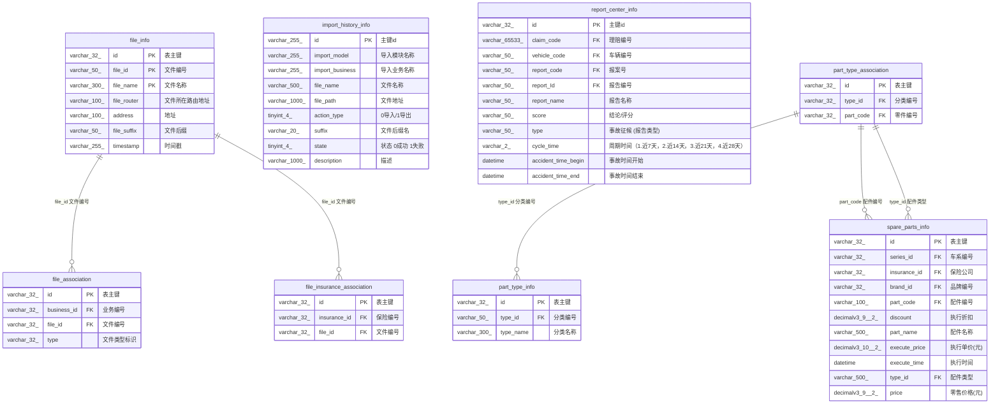

# insurance_business ER 视图

生成时间：2026-06-04 14:32:51  
数据源：Doris MySQL 协议 `192.168.100.114:9030/insurance_business`  
说明：ER 关系基于业务编号字段、同名字段、关联表命名和字段注释推断；Doris 元数据未提供显式外键；未查询业务数据。

阅读建议：每个 ER 图按业务域拆分；字段框内优先展示主键、业务编号、外键/关联字段和前若干业务字段，完整字段在最后的字段字典。

## 车辆主数据 ER



## 车型车款 ER

```mermaid
erDiagram
  manufacturer_company_info {
    varchar_32_ id PK "主键编号"
    varchar_32_ manufacturer_id FK "制造企业编号"
    varchar_300_ manufacturer_name "制造企业名称"
    varchar_100_ manufacturer_short_name "制造企业简称"
    varchar_500_ address "联系地址"
    varchar_1_ region_value "区域类型枚举值"
    varchar_200_ uscc "统一社会信用代码"
    varchar_100_ handler "经办人"
    varchar_20_ handler_phone "经办人联系电话"
  }
  brand_info {
    varchar_255_ id PK "主键id"
    varchar_100_ brand_id FK "品牌编号"
    varchar_100_ manufacturer_id FK "制造企业编号"
    varchar_255_ brand_name "品牌名称"
  }
  series_info {
    varchar_255_ id PK "主键id"
    varchar_100_ series_id FK "车系编号"
    varchar_100_ brand_id FK "品牌编号"
    varchar_255_ series_name "车系名称"
  }
  model_info {
    varchar_255_ id PK "主键id"
    varchar_100_ model_id FK "车型编号"
    varchar_100_ series_id FK "车系编号"
    varchar_255_ model_name "车型名称"
  }
  pattern_info {
    varchar_255_ id PK "主键id"
    varchar_100_ pattern_id FK "车款编号"
    varchar_100_ model_id FK "车型编号"
    varchar_255_ pattern_name "车款名称"
    varchar_300_ announce_number "车款公告号"
  }
  pattern_battery_info {
    varchar_32_ id PK "主键id"
    varchar_32_ pattern_id FK "车款编号"
    double all_quality "总质量"
    varchar_200_ battery_model "电池型号"
    varchar_200_ battery_type "电池类型"
    varchar_200_ cell_appearance "电芯单体外形"
    double cell_number "电芯数量"
    double continue_distance "标称续航"
    varchar_300_ energy_all_company "储能装置总成生产企业"
    varchar_300_ energy_monomer_company "储能装置单体生产企业"
    double nominal_capacity "标称容量"
    double nominal_power "标称能量"
    double battery_quality_year "电池质保年份"
    double battery_quality_distance "电池质保"
    double power_density "能量密度"
  }
  pattern_certificate_info {
    varchar_32_ id PK "主键id"
    varchar_32_ pattern_id FK "车款编号"
    double axis_distance "轴距"
    double axis_number "轴数"
    varchar_100_ axle_load "轴荷"
    varchar_100_ chassis_certificate "底盘合格证编号"
    varchar_100_ chassis_model "底盘型号/底盘ID"
    varchar_100_ coefficient "载质量利用系数"
    varchar_100_ displacement "排量"
    double drive_client "驾驶室准乘人数(人)"
    varchar_100_ emission_standards "排放标准"
    double equipment "整备质量"
    varchar_100_ fuel_consumption "油耗"
    varchar_100_ fuel_type "燃料种类"
    varchar_100_ internal_size "货箱内部尺寸，以\",\"分割"
    varchar_100_ most_drive_client "额定载客"
    varchar_100_ most_quality "半挂车鞍座最大允许总质量"
    double most_speed "最高设计车速"
    varchar_100_ overall_dimensions "外廓尺寸(mm)，以\",\"分割"
    double power "功率"
    string __more "另有 14 个字段，见字段字典"
  }
  pattern_drive_electric_motor_info {
    varchar_32_ id PK "主键id"
    varchar_32_ pattern_id FK "车款编号"
    varchar_20_ drive_motor_number "驱动电机数"
    varchar_255_ motor_brand "电机品牌"
    varchar_100_ motor_displace "电机布局"
    double motor_horse_power "电机总马力"
    varchar_255_ motor_model "电机型号"
    double motor_power "电机总功率"
    varchar_100_ motor_torque "电机总扭矩"
    varchar_100_ motor_type "电机类型"
  }
  pattern_assist_drive_function_info {
    varchar_32_ id PK "主键id"
    varchar_32_ pattern_id FK "车款编号"
    varchar_50_ acc_status "自适应巡航控制（ACC），0安装 1未安装 2未知"
    varchar_10_ aeb_status "自动紧急制动（AEB），0安装 1未安装 2未知"
    varchar_50_ auto_hold_status "自动驻车（AUTO HOLD），0安装 1未安装 2未知"
    varchar_50_ esc_status "车身稳定控制（ESC），0安装 1未安装 2未知"
    varchar_50_ fcw_status "前方碰撞预警（FCW），0安装 1未安装 2未知"
    varchar_50_ headlight_status "大灯自动开启，0安装 1未安装 2未知"
    varchar_50_ hma_status "智能远近光灯（HMA），0安装 1未安装 2未知"
    varchar_50_ i_booster_status "线控制动系统（ESC + iBooster），0安装 1未安装 2未知"
    varchar_50_ isa_status "智能限速辅助（ISA），0安装 1未安装 2未知"
    varchar_50_ ldp_status "车道偏离抑制（LDP），0安装 1未安装 2未知"
    varchar_50_ ldw_status "车道偏离预警（LDW），0安装 1未安装 2未知"
    varchar_50_ rearview_status "倒车影像"
    varchar_10_ tja_ica_status "集成式巡航（TJA/ICA），0安装 1未安装 2未知"
  }
  brand_info ||--o{ series_info : "brand_id 品牌编号"
  manufacturer_company_info ||--o{ brand_info : "manufacturer_id 制造企业编号"
  model_info ||--o{ pattern_info : "model_id 车型编号"
  pattern_info ||--o{ pattern_assist_drive_function_info : "pattern_id 车款编号"
  pattern_info ||--o{ pattern_battery_info : "pattern_id 车款编号"
  pattern_info ||--o{ pattern_certificate_info : "pattern_id 车款编号"
  pattern_info ||--o{ pattern_drive_electric_motor_info : "pattern_id 车款编号"
  series_info ||--o{ model_info : "series_id 车系编号"
```

## 保险业务 ER

```mermaid
erDiagram
  vehicle_basic_info {
    varchar_32_ id PK "表主键"
    varchar_32_ vehicle_code FK "车辆编号"
    varchar_300_ brand_id FK "品牌编号"
    varchar_128_ series_id FK "车系编号"
    varchar_32_ pattern_id FK "车款编号"
    varchar_32_ vehicle_basic_id FK "车辆编号"
    varchar_32_ model_id FK "车型编号"
    varchar_50_ store_id FK "门店编号"
    varchar_3_ battery_year "battery_year"
    varchar_3_ auth_status "认证状态"
    varchar_3_ repair_status "维修记录"
    varchar_3_ claims_status "理赔记录"
    varchar_300_ vehicle_tag "车辆标签"
    tinyint_4_ hot_status "是否热门0：否，1：是"
    varchar_300_ transfer_number "过户次数"
    varchar_300_ interior_condition "内饰成色"
    varchar_300_ most_repair "重大修复"
    varchar_300_ operating_conditions "工况"
    varchar_100_ vehicle_year "车龄"
    varchar_200_ vehicle_distance "车辆里程数"
    string __more "另有 12 个字段，见字段字典"
  }
  insurance_company_info {
    varchar_32_ id PK "主键编号"
    varchar_50_ parent_id FK "父级编号"
    varchar_32_ insurance_company_id FK "保险公司编号"
    varchar_300_ company_name "保险公司名称"
    varchar_100_ company_short_name "保险公司简称"
    varchar_1_ company_type "保险公司类型，1：总公司，2：分公司"
    varchar_300_ company_type_name "保险公司类型名称"
    varchar_500_ address "联系地址"
    varchar_200_ uscc "统一社会信用代码"
    varchar_200_ data_email "数据同步邮箱"
    varchar_100_ handler "经办人"
    varchar_20_ handler_phone "经办人联系电话"
    varchar_100_ insurance_leader "车险部负责人"
    varchar_100_ insurance_leader_phone "车险部负责人联系电话"
    varchar_100_ insurance_claims_leader "理赔部负责人"
    varchar_20_ insurance_claims_leader_phone "理赔部负责人电话"
    varchar_100_ insurance_verify_leader "核保部负责人"
    varchar_20_ insurance_verify_leader_phone "核保部负责人电话"
    varchar_1_ region_value "区域类型枚举值"
  }
  insurance_type_info {
    varchar_32_ id PK "主键编号"
    varchar_32_ insurance_type_id FK "险种编号"
    varchar_255_ insurance_full_name "险种名称"
    varchar_100_ insurance_short_name "险种简称"
    varchar_1_ insurance_type "险种类型"
    varchar_1_ insurance_major_type "主附分类"
  }
  vehicle_insurance_info {
    varchar_32_ id PK "主键编号"
    varchar_32_ vehicle_insurance_id FK "车辆保险业务编号"
    varchar_100_ insurance_id FK "保单编号"
    varchar_32_ vehicle_code FK "车辆编号"
    varchar_32_ insurance_company_id FK "承保机构"
    varchar_1_ insurance_is_cancel "保单状态：1：未生效，2：生效中，3：已过期，4：退保"
    decimalv3_15__2_ cancel_premium "退保保费"
    decimalv3_15__2_ invoice_amount "发票金额(元)"
    datetime insurance_time_begin "保险时间开始"
    datetime insurance_time_finish "保险时间结束"
    varchar_300_ vehicle_insurance_type "区分车险中（3.商业险，2.交强险，4.驾乘险，1，责任险）"
    tinyint_4_ split_status "是否为拆分保单（0.否，1.是）"
    date cancel_date "退保日期"
    date registration_date "新车购置登记年月"
    varchar_64_ vehicle_nature "车辆使用性质"
    decimalv3_15__2_ total_insurance_amount "total_insurance_amount"
    decimalv3_15__2_ total_premium "total_premium"
  }
  vehicle_insurance_subordinate_info {
    varchar_32_ id PK "主键编号"
    varchar_100_ insurance_id FK "保单编号"
    varchar_32_ vehicle_insurance_id FK "车辆保险编号"
    varchar_32_ vehicle_code FK "车辆编号"
    varchar_32_ insurance_type_id FK "险种编号"
    varchar_300_ insurance_custom_name "险种自定义名称"
    varchar_500_ insurance_amount "保险金额/责任限额（元）"
    decimalv3_15__2_ insurance_amount_number "insurance_amount_number"
    decimalv3_15__2_ premium "保险费"
  }
  vehicle_split_insurance_info {
    varchar_32_ id PK "主键编号"
    varchar_100_ insurance_id FK "保单编号"
    varchar_100_ split_group_id FK "父表中的车辆保险业务编号"
    datetime insurance_time_begin "保险时间开始"
    varchar_1_ insurance_type "区分车险中（3.商业险，2.交强险，4.驾乘险，1，责任险）"
    datetime insurance_time_finish "保险时间结束"
    decimalv3_15__2_ total_premium "总的保险费"
  }
  vehicle_insurance_id_info {
    varchar_64_ system_insurance_id FK "保险系统编号"
    varchar_64_ insurance_id FK "保险编号"
    varchar_32_ vehicle_code FK "车辆编号"
    datetime insurance_time_begin "保险开始时间"
    datetime insurance_time_finish "保险结束事件"
    varchar_300_ vehicle_insurance_id_info "区分车险中（3.商业险，2.交强险，4.驾乘险）"
    varchar_300_ vehicle_insurance_type "区分车险中（3.商业险，2.交强险，4.驾乘险）"
  }
  type_insurance_association {
    varchar_32_ id PK "表主键"
    varchar_32_ insurance_id FK "保险公司编号"
    varchar_32_ insurance_type_id FK "险种编号"
  }
  store_insurance_association {
    varchar_32_ id PK "表主键"
    varchar_32_ insurance_id FK "保险公司编号"
    varchar_32_ store_id FK "门店编号"
  }
  file_insurance_association {
    varchar_32_ id PK "表主键"
    varchar_32_ insurance_id FK "保险编号"
    varchar_32_ file_id FK "文件编号"
  }
  file_info {
    varchar_32_ id PK "表主键"
    varchar_50_ file_id PK "文件编号"
    varchar_300_ file_name PK "文件名称"
    varchar_100_ file_router "文件所在路由地址"
    varchar_100_ address "地址"
    varchar_50_ file_suffix "文件后缀"
    varchar_255_ timestamp "时间戳"
  }
  file_info ||--o{ file_insurance_association : "file_id 文件编号"
  insurance_company_info ||--o{ vehicle_insurance_info : "insurance_company_id 承保机构"
  insurance_type_info ||--o{ type_insurance_association : "insurance_type_id 险种编号"
  insurance_type_info ||--o{ vehicle_insurance_subordinate_info : "insurance_type_id 险种编号"
  vehicle_basic_info ||--o{ vehicle_insurance_id_info : "vehicle_code 车辆编号"
  vehicle_basic_info ||--o{ vehicle_insurance_info : "vehicle_code 车辆编号"
  vehicle_basic_info ||--o{ vehicle_insurance_subordinate_info : "vehicle_code 车辆编号"
  vehicle_insurance_info ||--o{ file_insurance_association : "insurance_id 保险编号"
  vehicle_insurance_info ||--o{ store_insurance_association : "insurance_id 保险公司编号"
  vehicle_insurance_info ||--o{ type_insurance_association : "insurance_id 保险公司编号"
  vehicle_insurance_info ||--o{ vehicle_insurance_id_info : "insurance_id 保险编号"
  vehicle_insurance_info ||--o{ vehicle_insurance_subordinate_info : "insurance_id 保单编号"
  vehicle_insurance_info ||--o{ vehicle_insurance_subordinate_info : "vehicle_insurance_id 车辆保险编号"
  vehicle_insurance_info ||--o{ vehicle_split_insurance_info : "insurance_id 保单编号"
```



## 理赔事故 ER

```mermaid
erDiagram
  vehicle_basic_info {
    varchar_32_ id PK "表主键"
    varchar_32_ vehicle_code FK "车辆编号"
    varchar_300_ brand_id FK "品牌编号"
    varchar_128_ series_id FK "车系编号"
    varchar_32_ pattern_id FK "车款编号"
    varchar_32_ vehicle_basic_id FK "车辆编号"
    varchar_32_ model_id FK "车型编号"
    varchar_50_ store_id FK "门店编号"
    varchar_3_ battery_year "battery_year"
    varchar_3_ auth_status "认证状态"
    varchar_3_ repair_status "维修记录"
    varchar_3_ claims_status "理赔记录"
    varchar_300_ vehicle_tag "车辆标签"
    tinyint_4_ hot_status "是否热门0：否，1：是"
    varchar_300_ transfer_number "过户次数"
    varchar_300_ interior_condition "内饰成色"
    varchar_300_ most_repair "重大修复"
    varchar_300_ operating_conditions "工况"
    varchar_100_ vehicle_year "车龄"
    varchar_200_ vehicle_distance "车辆里程数"
    string __more "另有 12 个字段，见字段字典"
  }
  insurance_vehicle_claims_info {
    varchar_32_ id PK "主键id"
    varchar_65533_ claim_code FK "理赔编号"
    varchar_50_ vehicle_code FK "车辆编号"
    varchar_100_ report_code FK "报案号"
    varchar_100_ detail "车受损部位，用“.”分隔"
    varchar_100_ drive_person_code FK "报案驾驶人编号"
    varchar_100_ other_person_code FK "三者驾驶人编号"
    varchar_100_ insurance_person_code FK "被保险人编号"
    datetime insurance_time "报案出险时间"
    varchar_500_ location "报案出险地点"
    decimalv3_9__6_ longitude "经度"
    decimalv3_9__6_ latitude "纬度"
    varchar_200_ reason "事故成因"
    varchar_2000_ reason_description "经过陈述"
    datetime report_time "报案时间"
    varchar_200_ status "1.已调查，2.待调查"
    varchar_1_ road_attribute "1：高速，2：国道、省道、乡道，3：城区道路"
    varchar_1_ speed_type "高速限制  1：60，2：80，3：100，4：110，5：120"
    varchar_255_ fault_judgment "交通事故中三者过错判断"
    varchar_200_ type "事故症候，若多项以\",\"分隔"
    string __more "另有 4 个字段，见字段字典"
  }
  insurance_vehicle_claims_history {
    varchar_32_ id PK "主键编号"
    varchar_50_ claim_code FK "理赔编号"
    varchar_1_ business_type "业务编号类型"
  }
  vehicle_claim_event {
    varchar_32_ id PK "主键id"
    varchar_32_ vehicle_code FK "车辆编号"
    varchar_100_ report_code FK "报案号"
    varchar_100_ policy_code FK "保单单号"
    varchar_100_ vehicle_pay_id FK "车辆理赔编号"
    varchar_32_ accident_type "事故类型"
    varchar_1_ insurance_type "出险保险类型（责任险，商业险，交强险）"
    varchar_100_ beneficiary "指定索赔权益人"
    varchar_300_ company_name "承保机构"
    varchar_32_ duty "责任比例"
    decimalv3_15__2_ pay "理赔金额"
    varchar_512_ location "出险地点"
    string reason "出险原因"
    datetime insurance_time "出险时间"
    datetime report_time "报案时间"
    datetime close_time "结案时间"
  }
  vehicle_outstanding_loss_estimate {
    varchar_32_ id PK "表主键"
    varchar_32_ vehicle_code FK "车辆编号"
    varchar_100_ report_code FK "报案号"
    varchar_32_ insurance_company_id FK "保险公司编号"
    varchar_1_ claim_status "出险状态：0-未结案，1-已结案"
    decimalv3_5__2_ liability_coefficient "责任系数"
    decimalv3_9__2_ outstanding_amount "未决估损金额"
    decimalv3_9__2_ settled_amount "已决估损金额"
    string reserve_estimate "估损评定说明"
    datetime report_time "报案时间"
    datetime claim_time "出险时间"
    varchar_1_ accident_type "事故类型：1-双方，2-单方，3-多方"
    varchar_500_ claim_address "出险地点"
    varchar_1_ address_type "地点特征：1-有信号灯路段，2-无信号灯路段，3-路段，4-非道路，5-道路"
    varchar_1_ result_type "结果特征：1-残疾，2-死亡，3-非死非残"
    varchar_500_ maintenance_address "维修单位"
    varchar_1_ accident_pass "标的车事故经过：1-直行，2-转弯，3-变道，4-掉头，5-倒车，6-静止"
    varchar_1_ three_accident "三者事故经过：1-直行，2-转弯，3-变道，4-掉头，5-倒车，6-静止"
    varchar_200_ vehicle_speed_enum "车速相关，多选用,分割"
    varchar_200_ drive_pass_enum "让行与通行，多选用,分割"
    string __more "另有 6 个字段，见字段字典"
  }
  accident_responsibility_report {
    varchar_32_ id PK "主键id"
    varchar_32_ vehicle_code FK "车辆编号"
    varchar_32_ report_code FK "报案号"
    varchar_32_ accident_code FK "报告编号"
    datetime judge_time "评定日期"
  }
  morality_risk_analyze_report {
    varchar_32_ id PK "主键id"
    varchar_32_ accident_code FK "事故责任报告编号"
    varchar_32_ moral_code FK "道德风险研判报告编号"
    datetime judge_time "评定日期"
  }
  email_send_info {
    varchar_32_ id PK "表主键"
    varchar_50_ email_send_id PK "邮件发送编号"
    varchar_200_ cw_id FK "疑似事故编号"
    varchar_32_ vehicle_code FK "车辆编号"
    varchar_1_ email_send_status "邮件发送状态   1：已发送，2：未发送"
    varchar_200_ data_email "数据推送邮箱"
    datetime cw_time "碰撞事件时间"
  }
  suspected_is_delete {
    varchar_32_ id PK "主键编号"
    varchar_32_ suspected_id FK "险种编号"
  }
  insurance_company_info {
    varchar_32_ id PK "主键编号"
    varchar_50_ parent_id FK "父级编号"
    varchar_32_ insurance_company_id FK "保险公司编号"
    varchar_300_ company_name "保险公司名称"
    varchar_100_ company_short_name "保险公司简称"
    varchar_1_ company_type "保险公司类型，1：总公司，2：分公司"
    varchar_300_ company_type_name "保险公司类型名称"
    varchar_500_ address "联系地址"
    varchar_200_ uscc "统一社会信用代码"
    varchar_200_ data_email "数据同步邮箱"
    varchar_100_ handler "经办人"
    varchar_20_ handler_phone "经办人联系电话"
    varchar_100_ insurance_leader "车险部负责人"
    varchar_100_ insurance_leader_phone "车险部负责人联系电话"
    varchar_100_ insurance_claims_leader "理赔部负责人"
    varchar_20_ insurance_claims_leader_phone "理赔部负责人电话"
    varchar_100_ insurance_verify_leader "核保部负责人"
    varchar_20_ insurance_verify_leader_phone "核保部负责人电话"
    varchar_1_ region_value "区域类型枚举值"
  }
  accident_responsibility_report ||--o{ morality_risk_analyze_report : "accident_code 事故责任报告编号"
  insurance_company_info ||--o{ vehicle_outstanding_loss_estimate : "insurance_company_id 保险公司编号"
  insurance_vehicle_claims_info ||--o{ accident_responsibility_report : "report_code 报案号"
  insurance_vehicle_claims_info ||--o{ insurance_vehicle_claims_history : "claim_code 理赔编号"
  insurance_vehicle_claims_info ||--o{ vehicle_claim_event : "report_code 报案号"
  insurance_vehicle_claims_info ||--o{ vehicle_outstanding_loss_estimate : "report_code 报案号"
  suspected_is_delete ||--o{ email_send_info : "cw_id 疑似事故编号"
  vehicle_basic_info ||--o{ accident_responsibility_report : "vehicle_code 车辆编号"
  vehicle_basic_info ||--o{ email_send_info : "vehicle_code 车辆编号"
  vehicle_basic_info ||--o{ insurance_vehicle_claims_info : "vehicle_code 车辆编号"
  vehicle_basic_info ||--o{ vehicle_claim_event : "vehicle_code 车辆编号"
  vehicle_basic_info ||--o{ vehicle_outstanding_loss_estimate : "vehicle_code 车辆编号"
```

## 金融门店 ER



## 标签关注策略 ER

```mermaid
erDiagram
  vehicle_basic_info {
    varchar_32_ id PK "表主键"
    varchar_32_ vehicle_code FK "车辆编号"
    varchar_300_ brand_id FK "品牌编号"
    varchar_128_ series_id FK "车系编号"
    varchar_32_ pattern_id FK "车款编号"
    varchar_32_ vehicle_basic_id FK "车辆编号"
    varchar_32_ model_id FK "车型编号"
    varchar_50_ store_id FK "门店编号"
    varchar_3_ battery_year "battery_year"
    varchar_3_ auth_status "认证状态"
    varchar_3_ repair_status "维修记录"
    varchar_3_ claims_status "理赔记录"
    varchar_300_ vehicle_tag "车辆标签"
    tinyint_4_ hot_status "是否热门0：否，1：是"
    varchar_300_ transfer_number "过户次数"
    varchar_300_ interior_condition "内饰成色"
    varchar_300_ most_repair "重大修复"
    varchar_300_ operating_conditions "工况"
    varchar_100_ vehicle_year "车龄"
    varchar_200_ vehicle_distance "车辆里程数"
    string __more "另有 12 个字段，见字段字典"
  }
  attention_info {
    varchar_32_ id PK "主键id"
    varchar_32_ attention_id FK "关注编号"
    varchar_32_ user_id FK "创建人"
    varchar_300_ attention_name "关注名称"
  }
  attention_basic_info {
    varchar_32_ id PK "主键id"
    varchar_32_ attention_id FK "关注编号"
    varchar_32_ pattern_id FK "车款编号"
    varchar_32_ brand_id FK "品牌编号"
    varchar_32_ model_id FK "车型编号"
    varchar_32_ series_id FK "车系编号"
    varchar_1_ auth_status "授权状态，1：已授权，2：取消授权，3：全部"
    varchar_1_ battery_quality "电池剩余保质期，1：全部，2：三年以上，3：1至三年，4：三个月至一年，5：三个月以内"
    varchar_1_ claims_history "维保记录，1：有记录，2：无记录，3：全部"
    varchar_1_ duty_insurance_cancel "责任险状态，1：正常，2：到期，3：退保，4：全部"
    varchar_1_ business_insurance_cancel "商业险状态：1：未生效，2：生效中，3：已过期，4：退保"
    varchar_1_ traffic_insurance_cancel "交强险状态：1：未生效，2：生效中，3：已过期，4：退保"
    varchar_1_ drive_insurance_cancel "驾乘险状态：1：未生效，2：生效中，3：已过期，4：退保"
    varchar_255_ vehicle_insurance_cancel "vehicle_insurance_cancel"
    varchar_1_ repair_history "维保记录，1：有记录，2：无记录，3：全部"
    varchar_1_ vehicle_nature "使用性质，1：全部，2：营业车辆，3：非营业车辆"
    double vehicle_year_end "车龄结束"
    double vehicle_year_start "车龄开始"
    double residual_score_end "残值评估结束"
    double residual_score_start "残值评估开始"
  }
  attention_big_data_info {
    varchar_32_ id PK "主键id"
    varchar_32_ attention_id FK "关注编号"
    double battery_score_end "电池健康结束"
    double battery_score_start "电池健康开始"
    double health_score_end "健康度结束"
    double health_score_start "健康度开始"
    double drive_score_end "驾驶行为结束"
    double drive_score_start "驾驶行为开始"
    varchar_5_ ads_level "智驾等级，0：未开启，1：标准智驾，2：高级智驾，3：全部"
    double distance_end "里程范围结束"
    double distance_start "里程范围开始"
    varchar_5_ business_status "营业识别，1：全部，2：疑似营业"
  }
  attention_tag_association {
    varchar_32_ id PK "主键id"
    varchar_32_ attention_id FK "关注编号"
    varchar_32_ tag_id FK "标签编号"
  }
  tag_type {
    varchar_32_ id PK "主键"
    varchar_32_ type_id FK "业务编号"
    varchar_128_ type_name "标签分类名称"
    varchar_64_ type_code FK "标签分类编号"
    varchar_255_ description "分类描述"
    varchar_16_ bg_color "背景色 HEX，如 #FFFFFF"
    varchar_16_ text_color "文字颜色 HEX，如 #000000"
  }
  tag_indicators {
    varchar_32_ id PK "表主键"
    varchar_32_ indicator_id FK "业务主键"
    varchar_60_ indicator_name "指标名称"
    varchar_60_ indicator_code FK "指标编码"
    varchar_60_ indicator_type "指标类型"
    varchar_1000_ biz_desc "业务描述"
    varchar_90_ datasource "数据来源"
    varchar_90_ data_field "数据字段"
    varchar_100_ data_type "数据类型（整数、字符串、浮点等）"
  }
  tag_content {
    varchar_32_ id PK "表主键"
    varchar_32_ tag_id FK "业务主键"
    varchar_90_ tag_name "标签名称"
    varchar_120_ tag_code FK "标签编码"
    varchar_1000_ business_desc "业务描述"
    varchar_32_ tag_type "标签所属分类（tag_type业务编号）"
    varchar_2_ refresh_type "更新频率：1天 2周 3月 4年"
    tinyint_4_ is_enable "是否立即开启：0否 1是"
    varchar_32_ config_mode "配置方式"
    varchar_15000_ content "配置内容"
  }
  vehicle_tag {
    varchar_64_ vehicle_code FK "车辆编号"
    varchar_64_ tag_id FK "标签编号"
  }
  strategy_risk_insight {
    varchar_32_ id PK "主键id"
    varchar_50_ risk_alarm_id FK "风险预警编号"
    varchar_300_ insight_title "洞察标题"
    varchar_1_ strategy_status "策略状态 0：已启用，1：已禁用"
    string insight_description "洞察详细描述"
    varchar_2_ insight_level "洞察等级，1：高，2：中，3：低"
    varchar_2_ insight_type "洞察内容标识，1：还款能力，2：风险提示，3：历史风险洞察，4：通用风险"
    varchar_50_ prompt_id FK "提示语编号"
    varchar_2_ service_object "服务对象，1：保险，2：银行，3：通用"
    string strategy_description "策略描述"
    varchar_200_ strategy_name "策略名称"
    string content "规则构建区域"
  }
  strategy_suggestion {
    varchar_32_ id PK "主键id"
    varchar_32_ suggestion_id FK "建议编号"
    varchar_200_ service_object "服务对象"
    varchar_1_ category "分类，1：沟通类，2：核查类，3：业务处置类"
    varchar_1000_ suggestion_content "建议内容"
  }
  insight_suggestion_association {
    varchar_32_ id PK "主键id"
    varchar_32_ risk_alarm_id FK "洞察编号"
    varchar_255_ suggestion_id FK "建议编号"
  }
  vehicle_risk_insight {
    varchar_64_ vehicle_code FK "车辆编号"
    varchar_64_ risk_alarm_id FK "风险洞察编号"
  }
  risk_type_association_info {
    varchar_32_ id PK "表主键"
    varchar_100_ parent_id FK "父级编号"
    varchar_32_ risk_id FK "风险编号"
    varchar_50_ risk_type "风险信息枚举 1：风险类型，2：风险类别"
    varchar_300_ name "名称"
    varchar_500_ description "规则说明"
  }
  strategy_prompt {
    varchar_32_ id PK "主键id"
    varchar_100_ prompt_id FK "提示语编号"
    varchar_500_ prompt_name "提示语名称"
  }
  attention_info ||--o{ attention_basic_info : "attention_id 关注编号"
  attention_info ||--o{ attention_big_data_info : "attention_id 关注编号"
  attention_info ||--o{ attention_tag_association : "attention_id 关注编号"
  strategy_prompt ||--o{ strategy_risk_insight : "prompt_id 提示语编号"
  strategy_risk_insight ||--o{ insight_suggestion_association : "risk_alarm_id 洞察编号"
  strategy_risk_insight ||--o{ vehicle_risk_insight : "risk_alarm_id 风险洞察编号"
  strategy_suggestion ||--o{ insight_suggestion_association : "suggestion_id 建议编号"
  tag_content ||--o{ attention_tag_association : "tag_id 标签编号"
  tag_content ||--o{ vehicle_tag : "tag_id 标签编号"
  vehicle_basic_info ||--o{ vehicle_risk_insight : "vehicle_code 车辆编号"
  vehicle_basic_info ||--o{ vehicle_tag : "vehicle_code 车辆编号"
```



## 文件零配件报告 ER



## 关联关系明细

| 父/主表 | 子/引用表 | 关联字段 | 字段注释 | 依据 |
|---|---|---|---|---|
| accident_responsibility_report | morality_risk_analyze_report | `accident_code` | 事故责任报告编号 | 同名字段 |
| attention_info | attention_basic_info | `attention_id` | 关注编号 | 命名推断 |
| attention_info | attention_big_data_info | `attention_id` | 关注编号 | 命名推断 |
| attention_info | attention_tag_association | `attention_id` | 关注编号 | 命名推断 |
| bank_info | insurance_company_info | `parent_id` | 父级编号 | 同名字段 |
| bank_info | risk_type_association_info | `parent_id` | 父级编号 | 同名字段 |
| bank_info | vehicle_bank_info | `bank_id` | 银行编号 | 命名推断 |
| bank_info | vehicle_loan_event | `bank_id` | 银行编号 | 命名推断 |
| brand_info | attention_basic_info | `brand_id` | 品牌编号 | 命名推断 |
| brand_info | series_info | `brand_id` | 品牌编号 | 命名推断 |
| brand_info | spare_parts_info | `brand_id` | 品牌编号 | 命名推断 |
| brand_info | vehicle_basic_info | `brand_id` | 品牌编号 | 命名推断 |
| credit_company_info | vehicle_auth_info | `credit_company_id` | 征信公司编号，数据接收方 | 同名字段 |
| file_info | file_association | `file_id` | 文件编号 | 命名推断 |
| file_info | file_insurance_association | `file_id` | 文件编号 | 命名推断 |
| insurance_company_info | vehicle_insurance_info | `insurance_company_id` | 承保机构 | 命名推断 |
| insurance_company_info | vehicle_insurance_info_backup | `insurance_company_id` | 承保机构 | 命名推断 |
| insurance_company_info | vehicle_insurance_info_backup_copy | `insurance_company_id` | 承保机构 | 命名推断 |
| insurance_company_info | vehicle_outstanding_loss_estimate | `insurance_company_id` | 保险公司编号 | 命名推断 |
| insurance_type_info | type_insurance_association | `insurance_type_id` | 险种编号 | 命名推断 |
| insurance_type_info | vehicle_insurance_info_backup_copy | `insurance_type_id` | 险种编号 | 命名推断 |
| insurance_type_info | vehicle_insurance_subordinate_info | `insurance_type_id` | 险种编号 | 命名推断 |
| insurance_type_info | vehicle_insurance_subordinate_info_backup | `insurance_type_id` | 险种编号 | 命名推断 |
| insurance_vehicle_claims_info | accident_responsibility_report | `report_code` | 报案号 | 命名推断 |
| insurance_vehicle_claims_info | insurance_vehicle_claims_history | `claim_code` | 理赔编号 | 命名推断 |
| insurance_vehicle_claims_info | report_center_info | `claim_code` | 理赔编号 | 命名推断 |
| insurance_vehicle_claims_info | report_center_info | `report_code` | 报案号 | 命名推断 |
| insurance_vehicle_claims_info | vehicle_claim_event | `report_code` | 报案号 | 命名推断 |
| insurance_vehicle_claims_info | vehicle_outstanding_loss_estimate | `report_code` | 报案号 | 命名推断 |
| loan_product_info | vehicle_bank_info | `product_type_id` | 贷款产品编号 | 命名推断 |
| loan_product_info | vehicle_loan_event | `product_type_id` | 贷款产品编号 | 命名推断 |
| manufacturer_company_info | brand_info | `manufacturer_id` | 制造企业编号 | 命名推断 |
| manufacturer_company_info | store_info | `manufacturer_id` | 制造企业编号 | 命名推断 |
| manufacturer_company_info | vehicle_auth_info | `manufacturer_id` | 车辆制造商，数据提供方 | 命名推断 |
| model_info | attention_basic_info | `model_id` | 车型编号 | 命名推断 |
| model_info | pattern_info | `model_id` | 车型编号 | 命名推断 |
| model_info | vehicle_basic_info | `model_id` | 车型编号 | 命名推断 |
| part_type_association | part_type_info | `type_id` | 分类编号 | 命名推断 |
| part_type_association | spare_parts_info | `part_code` | 配件编号 | 命名推断 |
| part_type_association | spare_parts_info | `type_id` | 配件类型 | 命名推断 |
| part_type_association | tag_type | `type_id` | 业务编号 | 命名推断 |
| pattern_info | attention_basic_info | `pattern_id` | 车款编号 | 命名推断 |
| pattern_info | pattern_assist_drive_function_info | `pattern_id` | 车款编号 | 命名推断 |
| pattern_info | pattern_battery_info | `pattern_id` | 车款编号 | 命名推断 |
| pattern_info | pattern_certificate_info | `pattern_id` | 车款编号 | 命名推断 |
| pattern_info | pattern_drive_electric_motor_info | `pattern_id` | 车款编号 | 命名推断 |
| pattern_info | vehicle_basic_info | `pattern_id` | 车款编号 | 命名推断 |
| series_info | attention_basic_info | `series_id` | 车系编号 | 命名推断 |
| series_info | model_info | `series_id` | 车系编号 | 命名推断 |
| series_info | spare_parts_info | `series_id` | 车系编号 | 命名推断 |
| series_info | vehicle_basic_info | `series_id` | 车系编号 | 命名推断 |
| store_info | store_insurance_association | `store_id` | 门店编号 | 命名推断 |
| store_info | vehicle_bank_info | `store_id` | 门店编号 | 命名推断 |
| store_info | vehicle_basic_info | `store_id` | 门店编号 | 命名推断 |
| store_info | vehicle_loan_event | `store_id` | 门店编号 | 命名推断 |
| strategy_prompt | strategy_risk_insight | `prompt_id` | 提示语编号 | 同名字段 |
| strategy_risk_insight | insight_suggestion_association | `risk_alarm_id` | 洞察编号 | 命名推断 |
| strategy_risk_insight | vehicle_risk_insight | `risk_alarm_id` | 风险洞察编号 | 命名推断 |
| strategy_suggestion | insight_suggestion_association | `suggestion_id` | 建议编号 | 命名推断 |
| suspected_is_delete | email_send_info | `cw_id` | 疑似事故编号 | 命名推断 |
| tag_content | attention_tag_association | `tag_id` | 标签编号 | 命名推断 |
| tag_content | vehicle_tag | `tag_id` | 标签编号 | 命名推断 |
| vehicle_basic_info | accident_responsibility_report | `vehicle_code` | 车辆编号 | 命名推断 |
| vehicle_basic_info | email_send_info | `vehicle_code` | 车辆编号 | 命名推断 |
| vehicle_basic_info | insurance_vehicle_claims_info | `vehicle_code` | 车辆编号 | 命名推断 |
| vehicle_basic_info | report_center_info | `vehicle_code` | 车辆编号 | 命名推断 |
| vehicle_basic_info | vehicle_abnormal_info | `vehicle_code` | 车辆编号 | 命名推断 |
| vehicle_basic_info | vehicle_approved_info | `vehicle_code` | 车辆编号，主键 | 命名推断 |
| vehicle_basic_info | vehicle_auth_info | `vehicle_code` | 车辆编号 | 命名推断 |
| vehicle_basic_info | vehicle_bank_info | `vehicle_code` | 车辆编号 | 命名推断 |
| vehicle_basic_info | vehicle_certificate_info | `vehicle_code` | 车辆编号 | 命名推断 |
| vehicle_basic_info | vehicle_claim_event | `vehicle_code` | 车辆编号 | 命名推断 |
| vehicle_basic_info | vehicle_insurance_id_info | `vehicle_code` | 车辆编号 | 命名推断 |
| vehicle_basic_info | vehicle_insurance_info | `vehicle_code` | 车辆编号 | 命名推断 |
| vehicle_basic_info | vehicle_insurance_info_backup | `vehicle_code` | 车辆编号 | 命名推断 |
| vehicle_basic_info | vehicle_insurance_info_backup_copy | `vehicle_code` | 车辆编号 | 命名推断 |
| vehicle_basic_info | vehicle_insurance_subordinate_info | `vehicle_code` | 车辆编号 | 命名推断 |
| vehicle_basic_info | vehicle_insurance_subordinate_info_backup | `vehicle_code` | 车辆编号 | 命名推断 |
| vehicle_basic_info | vehicle_loan_event | `vehicle_code` | 车辆编号 | 命名推断 |
| vehicle_basic_info | vehicle_outstanding_loss_estimate | `vehicle_code` | 车辆编号 | 命名推断 |
| vehicle_basic_info | vehicle_repair_event | `vehicle_code` | 车辆编号 | 命名推断 |
| vehicle_basic_info | vehicle_risk_insight | `vehicle_code` | 车辆编号 | 命名推断 |
| vehicle_basic_info | vehicle_tag | `vehicle_code` | 车辆编号 | 命名推断 |
| vehicle_insurance_id_info | vehicle_insurance_info_backup_copy | `system_insurance_id` | 系统保单编号 | 同名字段 |
| vehicle_insurance_info | file_insurance_association | `insurance_id` | 保险编号 | 命名推断 |
| vehicle_insurance_info | spare_parts_info | `insurance_id` | 保险公司 | 命名推断 |
| vehicle_insurance_info | store_insurance_association | `insurance_id` | 保险公司编号 | 命名推断 |
| vehicle_insurance_info | type_insurance_association | `insurance_id` | 保险公司编号 | 命名推断 |
| vehicle_insurance_info | vehicle_insurance_id_info | `insurance_id` | 保险编号 | 命名推断 |
| vehicle_insurance_info | vehicle_insurance_info_backup | `insurance_id` | 保单编号 | 命名推断 |
| vehicle_insurance_info | vehicle_insurance_info_backup | `vehicle_insurance_id` | 车辆保险编号 | 命名推断 |
| vehicle_insurance_info | vehicle_insurance_info_backup_copy | `insurance_id` | 保单编号 | 命名推断 |
| vehicle_insurance_info | vehicle_insurance_info_backup_copy | `vehicle_insurance_id` | 车辆保险编号 | 命名推断 |
| vehicle_insurance_info | vehicle_insurance_subordinate_info | `insurance_id` | 保单编号 | 命名推断 |
| vehicle_insurance_info | vehicle_insurance_subordinate_info | `vehicle_insurance_id` | 车辆保险编号 | 命名推断 |
| vehicle_insurance_info | vehicle_insurance_subordinate_info_backup | `insurance_id` | 保单编号 | 命名推断 |
| vehicle_insurance_info | vehicle_insurance_subordinate_info_backup | `vehicle_insurance_id` | 车辆保险编号 | 命名推断 |
| vehicle_insurance_info | vehicle_split_insurance_info | `insurance_id` | 保单编号 | 命名推断 |

## 完整字段字典

### accident_responsibility_report - 事故责任评定报告表

| 序号 | 字段名 | 类型 | 可空 | Key | 注释 |
|---:|---|---|---|---|---|
| 1 | `id` | `varchar(32)` | YES | UNI | 主键id |
| 2 | `accident_code` | `varchar(32)` | YES |  | 报告编号 |
| 3 | `vehicle_code` | `varchar(32)` | YES |  | 车辆编号 |
| 4 | `report_code` | `varchar(32)` | YES |  | 报案号 |
| 5 | `judge_time` | `datetime` | YES |  | 评定日期 |
| 6 | `create_by` | `varchar(100)` | YES |  | 创建者 |
| 7 | `create_time` | `datetime` | YES |  | 创建时间 |
| 8 | `update_by` | `varchar(100)` | YES |  | 更新者 |
| 9 | `update_time` | `datetime` | YES |  | 更新时间 |
| 10 | `is_deleted` | `varchar(10)` | YES |  | 是否删除（0：未删除，1：已删除） |
| 11 | `remark` | `varchar(500)` | YES |  | 备注 |
| 12 | `group_id` | `bigint(20)` | YES |  | 分组ID |
| 13 | `platform_id` | `bigint(20)` | YES |  | 平台ID（默认为0） |

### attention_basic_info - 高级筛选基础数据信息表

| 序号 | 字段名 | 类型 | 可空 | Key | 注释 |
|---:|---|---|---|---|---|
| 1 | `id` | `varchar(32)` | YES | UNI | 主键id |
| 2 | `attention_id` | `varchar(32)` | YES |  | 关注编号 |
| 3 | `auth_status` | `varchar(1)` | YES |  | 授权状态，1：已授权，2：取消授权，3：全部 |
| 4 | `battery_quality` | `varchar(1)` | YES |  | 电池剩余保质期，1：全部，2：三年以上，3：1至三年，4：三个月至一年，5：三个月以内 |
| 5 | `claims_history` | `varchar(1)` | YES |  | 维保记录，1：有记录，2：无记录，3：全部 |
| 6 | `duty_insurance_cancel` | `varchar(1)` | YES |  | 责任险状态，1：正常，2：到期，3：退保，4：全部 |
| 7 | `business_insurance_cancel` | `varchar(1)` | YES |  | 商业险状态：1：未生效，2：生效中，3：已过期，4：退保 |
| 8 | `traffic_insurance_cancel` | `varchar(1)` | YES |  | 交强险状态：1：未生效，2：生效中，3：已过期，4：退保 |
| 9 | `drive_insurance_cancel` | `varchar(1)` | YES |  | 驾乘险状态：1：未生效，2：生效中，3：已过期，4：退保 |
| 10 | `vehicle_insurance_cancel` | `varchar(255)` | YES |  |  |
| 11 | `pattern_id` | `varchar(32)` | YES |  | 车款编号 |
| 12 | `repair_history` | `varchar(1)` | YES |  | 维保记录，1：有记录，2：无记录，3：全部 |
| 13 | `vehicle_nature` | `varchar(1)` | YES |  | 使用性质，1：全部，2：营业车辆，3：非营业车辆 |
| 14 | `vehicle_year_end` | `double` | YES |  | 车龄结束 |
| 15 | `vehicle_year_start` | `double` | YES |  | 车龄开始 |
| 16 | `residual_score_end` | `double` | YES |  | 残值评估结束 |
| 17 | `residual_score_start` | `double` | YES |  | 残值评估开始 |
| 18 | `brand_id` | `varchar(32)` | YES |  | 品牌编号 |
| 19 | `model_id` | `varchar(32)` | YES |  | 车型编号 |
| 20 | `series_id` | `varchar(32)` | YES |  | 车系编号 |
| 21 | `create_by` | `varchar(100)` | YES |  | 创建者 |
| 22 | `create_time` | `datetime` | YES |  | 创建时间 |
| 23 | `update_by` | `varchar(100)` | YES |  | 更新者 |
| 24 | `update_time` | `datetime` | YES |  | 更新时间 |
| 25 | `is_deleted` | `varchar(10)` | YES |  | 是否删除（0：未删除，1：已删除） |
| 26 | `remark` | `varchar(500)` | YES |  | 备注 |
| 27 | `group_id` | `bigint(20)` | YES |  | 分组ID |
| 28 | `platform_id` | `bigint(20)` | YES |  | 平台ID（默认为0） |

### attention_big_data_info - 高级筛选数仓信息表

| 序号 | 字段名 | 类型 | 可空 | Key | 注释 |
|---:|---|---|---|---|---|
| 1 | `id` | `varchar(32)` | YES | UNI | 主键id |
| 2 | `attention_id` | `varchar(32)` | YES |  | 关注编号 |
| 3 | `battery_score_end` | `double` | YES |  | 电池健康结束 |
| 4 | `battery_score_start` | `double` | YES |  | 电池健康开始 |
| 5 | `health_score_end` | `double` | YES |  | 健康度结束 |
| 6 | `health_score_start` | `double` | YES |  | 健康度开始 |
| 7 | `drive_score_end` | `double` | YES |  | 驾驶行为结束 |
| 8 | `drive_score_start` | `double` | YES |  | 驾驶行为开始 |
| 9 | `ads_level` | `varchar(5)` | YES |  | 智驾等级，0：未开启，1：标准智驾，2：高级智驾，3：全部 |
| 10 | `distance_end` | `double` | YES |  | 里程范围结束 |
| 11 | `distance_start` | `double` | YES |  | 里程范围开始 |
| 12 | `business_status` | `varchar(5)` | YES |  | 营业识别，1：全部，2：疑似营业 |
| 13 | `create_by` | `varchar(100)` | YES |  | 创建者 |
| 14 | `create_time` | `datetime` | YES |  | 创建时间 |
| 15 | `update_by` | `varchar(100)` | YES |  | 更新者 |
| 16 | `update_time` | `datetime` | YES |  | 更新时间 |
| 17 | `is_deleted` | `varchar(10)` | YES |  | 是否删除（0：未删除，1：已删除） |
| 18 | `remark` | `varchar(500)` | YES |  | 备注 |
| 19 | `group_id` | `bigint(20)` | YES |  | 分组ID |
| 20 | `platform_id` | `bigint(20)` | YES |  | 平台ID（默认为0） |

### attention_info - 高级筛选关注信息表

| 序号 | 字段名 | 类型 | 可空 | Key | 注释 |
|---:|---|---|---|---|---|
| 1 | `id` | `varchar(32)` | YES | UNI | 主键id |
| 2 | `attention_id` | `varchar(32)` | YES |  | 关注编号 |
| 3 | `user_id` | `varchar(32)` | YES |  | 创建人 |
| 4 | `attention_name` | `varchar(300)` | YES |  | 关注名称 |
| 5 | `create_by` | `varchar(100)` | YES |  | 创建者 |
| 6 | `create_time` | `datetime` | YES |  | 创建时间 |
| 7 | `update_by` | `varchar(100)` | YES |  | 更新者 |
| 8 | `update_time` | `datetime` | YES |  | 更新时间 |
| 9 | `is_deleted` | `varchar(10)` | YES |  | 是否删除（0：未删除，1：已删除） |
| 10 | `remark` | `varchar(500)` | YES |  | 备注 |
| 11 | `group_id` | `bigint(20)` | YES |  | 分组ID |
| 12 | `platform_id` | `bigint(20)` | YES |  | 平台ID（默认为0） |

### attention_tag_association - 高级筛选关注与标签关系表

| 序号 | 字段名 | 类型 | 可空 | Key | 注释 |
|---:|---|---|---|---|---|
| 1 | `id` | `varchar(32)` | YES | UNI | 主键id |
| 2 | `attention_id` | `varchar(32)` | YES |  | 关注编号 |
| 3 | `tag_id` | `varchar(32)` | YES |  | 标签编号 |

### bank_info - 银行信息表

| 序号 | 字段名 | 类型 | 可空 | Key | 注释 |
|---:|---|---|---|---|---|
| 1 | `id` | `varchar(32)` | YES | UNI | 主键id |
| 2 | `bank_id` | `varchar(32)` | YES |  | 银行编号 |
| 3 | `bank_name` | `varchar(300)` | YES |  | 银行名称 |
| 4 | `bank_short_name` | `varchar(300)` | YES |  | 银行简称 |
| 5 | `bank_type` | `varchar(1)` | YES |  | 银行类型，1：总行，2：支行 |
| 6 | `address` | `varchar(512)` | YES |  | 联系地址 |
| 7 | `parent_id` | `varchar(32)` | YES |  | 父级编号 |
| 8 | `region_value` | `varchar(1)` | YES |  | 区域类型枚举值 |
| 9 | `uscc` | `varchar(100)` | YES |  | 统一社会信用代码 |
| 10 | `handler` | `varchar(100)` | YES |  | 经办人 |
| 11 | `handler_phone` | `varchar(32)` | YES |  | 经办人联系电话 |
| 12 | `risk_control_leader` | `varchar(100)` | YES |  | 风控部负责人 |
| 13 | `risk_control_leader_phone` | `varchar(32)` | YES |  | 风控部负责人联系电话 |
| 14 | `create_by` | `varchar(100)` | YES |  | 创建者 |
| 15 | `create_time` | `datetime` | YES |  | 创建时间 |
| 16 | `update_by` | `varchar(100)` | YES |  | 更新者 |
| 17 | `update_time` | `datetime` | YES |  | 更新时间 |
| 18 | `is_deleted` | `varchar(10)` | YES |  | 是否删除（0：未删除，1：已删除） |
| 19 | `remark` | `varchar(500)` | YES |  | 备注 |
| 20 | `group_id` | `bigint(20)` | YES |  | 分组ID |
| 21 | `platform_id` | `bigint(20)` | YES |  | 平台ID（默认为0） |
| 22 | `province_id` | `varchar(50)` | YES |  | 省编号 |
| 23 | `city_id` | `varchar(50)` | YES |  | 市编号 |
| 24 | `county_id` | `varchar(50)` | YES |  | 区县编号 |

### brand_info - 品牌信息表

| 序号 | 字段名 | 类型 | 可空 | Key | 注释 |
|---:|---|---|---|---|---|
| 1 | `id` | `varchar(255)` | YES | UNI | 主键id |
| 2 | `brand_id` | `varchar(100)` | YES |  | 品牌编号 |
| 3 | `brand_name` | `varchar(255)` | YES |  | 品牌名称 |
| 4 | `manufacturer_id` | `varchar(100)` | YES |  | 制造企业编号 |
| 5 | `create_by` | `varchar(100)` | YES |  | 创建者 |
| 6 | `create_time` | `datetime` | YES |  | 创建时间 |
| 7 | `update_by` | `varchar(100)` | YES |  | 更新者 |
| 8 | `update_time` | `datetime` | YES |  | 更新时间 |
| 9 | `is_deleted` | `varchar(10)` | YES |  | 是否删除（0：未删除，1：已删除） |
| 10 | `remark` | `varchar(500)` | YES |  | 备注 |
| 11 | `group_id` | `bigint(20)` | YES |  | 分组ID |
| 12 | `platform_id` | `bigint(20)` | YES |  | 平台ID（默认为0） |

### credit_company_info - 征信公司信息表

| 序号 | 字段名 | 类型 | 可空 | Key | 注释 |
|---:|---|---|---|---|---|
| 1 | `id` | `varchar(32)` | NO | UNI | 主键编号 |
| 2 | `credit_company_id` | `varchar(32)` | YES |  | 征信公司编号 |
| 3 | `credit_company_name` | `varchar(300)` | YES |  | 征信公司名称 |
| 4 | `credit_company_short_name` | `varchar(100)` | YES |  | 征信公司简称 |
| 5 | `province_id` | `varchar(50)` | YES |  | 省份编号 |
| 6 | `city_id` | `varchar(50)` | YES |  | 市编号 |
| 7 | `county_id` | `varchar(50)` | YES |  | 区县编号 |
| 8 | `address` | `varchar(500)` | YES |  | 地址 |
| 9 | `region_value` | `varchar(1)` | YES |  | 区域类型枚举值 |
| 10 | `uscc` | `varchar(200)` | YES |  | 统一社会信用代码 |
| 11 | `contact_person` | `varchar(100)` | YES |  | 联系人 |
| 12 | `contact_phone` | `varchar(20)` | YES |  | 联系电话 |
| 13 | `remark` | `varchar(1000)` | YES |  | 备注 |
| 14 | `create_by` | `varchar(200)` | YES |  | 创建者 |
| 15 | `create_time` | `datetime` | YES |  | 创建时间 |
| 16 | `update_by` | `varchar(200)` | YES |  | 更新者 |
| 17 | `update_time` | `datetime` | YES |  | 更新时间 |
| 18 | `is_deleted` | `varchar(1)` | YES |  | 是否删除 |
| 19 | `group_id` | `bigint(20)` | YES |  | 组织编号 |
| 20 | `platform_id` | `bigint(20)` | YES |  | 平台编号 |

### email_send_info - 邮件发送信息表

| 序号 | 字段名 | 类型 | 可空 | Key | 注释 |
|---:|---|---|---|---|---|
| 1 | `id` | `varchar(32)` | NO | UNI | 表主键 |
| 2 | `email_send_id` | `varchar(50)` | YES | UNI | 邮件发送编号 |
| 3 | `cw_id` | `varchar(200)` | YES |  | 疑似事故编号 |
| 4 | `email_send_status` | `varchar(1)` | YES |  | 邮件发送状态   1：已发送，2：未发送 |
| 5 | `data_email` | `varchar(200)` | YES |  | 数据推送邮箱 |
| 6 | `vehicle_code` | `varchar(32)` | YES |  | 车辆编号 |
| 7 | `cw_time` | `datetime` | YES |  | 碰撞事件时间 |
| 8 | `create_by` | `varchar(100)` | YES |  | 创建人 |
| 9 | `create_time` | `datetime` | YES |  | 创建时间 |
| 10 | `update_by` | `varchar(100)` | YES |  | 更新人 |
| 11 | `update_time` | `datetime` | YES |  | 更新时间 |
| 12 | `platform_id` | `bigint(20)` | YES |  | 平台编号 |
| 13 | `group_id` | `bigint(20)` | YES |  | 组织编号 |
| 14 | `is_deleted` | `varchar(1)` | YES |  | 是否删除 0 否 1 是 |
| 15 | `remark` | `varchar(200)` | YES |  | 备注 |

### file_association - 文件信息关联表

| 序号 | 字段名 | 类型 | 可空 | Key | 注释 |
|---:|---|---|---|---|---|
| 1 | `id` | `varchar(32)` | NO | UNI | 表主键 |
| 2 | `business_id` | `varchar(32)` | YES |  | 业务编号 |
| 3 | `file_id` | `varchar(32)` | YES |  | 文件编号 |
| 4 | `type` | `varchar(32)` | YES |  | 文件类型标识 |

### file_info - 文件信息表

| 序号 | 字段名 | 类型 | 可空 | Key | 注释 |
|---:|---|---|---|---|---|
| 1 | `id` | `varchar(32)` | NO | UNI | 表主键 |
| 2 | `file_id` | `varchar(50)` | YES | UNI | 文件编号 |
| 3 | `file_name` | `varchar(300)` | YES | UNI | 文件名称 |
| 4 | `file_router` | `varchar(100)` | YES |  | 文件所在路由地址 |
| 5 | `address` | `varchar(100)` | YES |  | 地址 |
| 6 | `file_suffix` | `varchar(50)` | YES |  | 文件后缀 |
| 7 | `timestamp` | `varchar(255)` | YES |  | 时间戳 |
| 8 | `create_by` | `varchar(100)` | YES |  | 创建人 |
| 9 | `create_time` | `datetime` | YES |  | 创建时间 |
| 10 | `update_by` | `varchar(100)` | YES |  | 更新人 |
| 11 | `update_time` | `datetime` | YES |  | 更新时间 |
| 12 | `platform_id` | `bigint(20)` | YES |  | 平台编号 |
| 13 | `group_id` | `bigint(20)` | YES |  | 组织编号 |
| 14 | `is_deleted` | `varchar(1)` | YES |  | 是否删除 0 否 1 是 |
| 15 | `remark` | `varchar(200)` | YES |  | 备注 |

### file_insurance_association - 保险文件信息关联表

| 序号 | 字段名 | 类型 | 可空 | Key | 注释 |
|---:|---|---|---|---|---|
| 1 | `id` | `varchar(32)` | NO | UNI | 表主键 |
| 2 | `insurance_id` | `varchar(32)` | YES |  | 保险编号 |
| 3 | `file_id` | `varchar(32)` | YES |  | 文件编号 |

### import_history_info - 文件导入时间信息表

| 序号 | 字段名 | 类型 | 可空 | Key | 注释 |
|---:|---|---|---|---|---|
| 1 | `id` | `varchar(255)` | YES | UNI | 主键id |
| 2 | `import_model` | `varchar(255)` | YES |  | 导入模块名称 |
| 3 | `import_business` | `varchar(255)` | YES |  | 导入业务名称 |
| 4 | `file_name` | `varchar(500)` | YES |  | 文件名称 |
| 5 | `file_path` | `varchar(1000)` | YES |  | 文件地址 |
| 6 | `action_type` | `tinyint(4)` | YES |  | 0导入/1导出 |
| 7 | `suffix` | `varchar(20)` | YES |  | 文件后缀名 |
| 8 | `state` | `tinyint(4)` | YES |  | 状态 0成功 1失败 |
| 9 | `description` | `varchar(1000)` | YES |  | 描述 |
| 10 | `create_by` | `varchar(100)` | YES |  | 创建者 |
| 11 | `create_time` | `datetime` | YES |  | 创建时间 |
| 12 | `update_by` | `varchar(100)` | YES |  | 更新者 |
| 13 | `update_time` | `datetime` | YES |  | 更新时间 |
| 14 | `is_deleted` | `varchar(10)` | YES |  | 是否删除（0：未删除，1：已删除） |
| 15 | `remark` | `varchar(500)` | YES |  | 备注 |
| 16 | `group_id` | `bigint(20)` | YES |  | 分组ID |
| 17 | `platform_id` | `bigint(20)` | YES |  | 平台ID（默认为0） |

### insight_suggestion_association - 洞察与建议关系表

| 序号 | 字段名 | 类型 | 可空 | Key | 注释 |
|---:|---|---|---|---|---|
| 1 | `id` | `varchar(32)` | YES | UNI | 主键id |
| 2 | `risk_alarm_id` | `varchar(32)` | YES |  | 洞察编号 |
| 3 | `suggestion_id` | `varchar(255)` | YES |  | 建议编号 |

### insurance_company_info - 保险公司信息表

| 序号 | 字段名 | 类型 | 可空 | Key | 注释 |
|---:|---|---|---|---|---|
| 1 | `id` | `varchar(32)` | NO | UNI | 主键编号 |
| 2 | `parent_id` | `varchar(50)` | YES |  | 父级编号 |
| 3 | `province_id` | `varchar(50)` | YES |  | 省编号 |
| 4 | `city_id` | `varchar(50)` | YES |  | 市编号 |
| 5 | `county_id` | `varchar(50)` | YES |  | 区县编号 |
| 6 | `insurance_company_id` | `varchar(32)` | YES |  | 保险公司编号 |
| 7 | `company_name` | `varchar(300)` | YES |  | 保险公司名称 |
| 8 | `company_short_name` | `varchar(100)` | YES |  | 保险公司简称 |
| 9 | `company_type` | `varchar(1)` | YES |  | 保险公司类型，1：总公司，2：分公司 |
| 10 | `company_type_name` | `varchar(300)` | YES |  | 保险公司类型名称 |
| 11 | `address` | `varchar(500)` | YES |  | 联系地址 |
| 12 | `platform_id` | `bigint(20)` | YES |  | 平台编号 |
| 13 | `uscc` | `varchar(200)` | YES |  | 统一社会信用代码 |
| 14 | `data_email` | `varchar(200)` | YES |  | 数据同步邮箱 |
| 15 | `handler` | `varchar(100)` | YES |  | 经办人 |
| 16 | `handler_phone` | `varchar(20)` | YES |  | 经办人联系电话 |
| 17 | `insurance_leader` | `varchar(100)` | YES |  | 车险部负责人 |
| 18 | `insurance_leader_phone` | `varchar(100)` | YES |  | 车险部负责人联系电话 |
| 19 | `insurance_claims_leader` | `varchar(100)` | YES |  | 理赔部负责人 |
| 20 | `insurance_claims_leader_phone` | `varchar(20)` | YES |  | 理赔部负责人电话 |
| 21 | `insurance_verify_leader` | `varchar(100)` | YES |  | 核保部负责人 |
| 22 | `insurance_verify_leader_phone` | `varchar(20)` | YES |  | 核保部负责人电话 |
| 23 | `region_value` | `varchar(1)` | YES |  | 区域类型枚举值 |
| 24 | `remark` | `varchar(1000)` | YES |  | 备注 |
| 25 | `create_by` | `varchar(200)` | YES |  | 创建者 |
| 26 | `create_time` | `datetime` | YES |  | 创建时间 |
| 27 | `update_by` | `varchar(200)` | YES |  | 更新者 |
| 28 | `update_time` | `datetime` | YES |  | 更新时间 |
| 29 | `is_deleted` | `varchar(1)` | YES |  | 是否删除 |
| 30 | `group_id` | `bigint(20)` | YES |  | 组织编号 |

### insurance_type_info - 险种信息表

| 序号 | 字段名 | 类型 | 可空 | Key | 注释 |
|---:|---|---|---|---|---|
| 1 | `id` | `varchar(32)` | NO | UNI | 主键编号 |
| 2 | `insurance_type_id` | `varchar(32)` | YES |  | 险种编号 |
| 3 | `insurance_full_name` | `varchar(255)` | YES |  | 险种名称 |
| 4 | `insurance_short_name` | `varchar(100)` | YES |  | 险种简称 |
| 5 | `insurance_type` | `varchar(1)` | YES |  | 险种类型 |
| 6 | `insurance_major_type` | `varchar(1)` | YES |  | 主附分类 |
| 7 | `remark` | `varchar(1000)` | YES |  | 备注 |
| 8 | `create_by` | `varchar(200)` | YES |  | 创建者 |
| 9 | `create_time` | `datetime` | YES |  | 创建时间 |
| 10 | `update_by` | `varchar(200)` | YES |  | 更新者 |
| 11 | `update_time` | `datetime` | YES |  | 更新时间 |
| 12 | `is_deleted` | `varchar(1)` | YES |  | 是否删除 |
| 13 | `group_id` | `bigint(20)` | YES |  | 组织编号 |
| 14 | `platform_id` | `bigint(20)` | YES |  | 平台编号 |

### insurance_vehicle_claims_history - 车辆理赔调查记录表

| 序号 | 字段名 | 类型 | 可空 | Key | 注释 |
|---:|---|---|---|---|---|
| 1 | `id` | `varchar(32)` | NO | UNI | 主键编号 |
| 2 | `claim_code` | `varchar(50)` | YES |  | 理赔编号 |
| 3 | `create_time` | `datetime` | YES |  | 创建时间 |
| 4 | `business_type` | `varchar(1)` | YES |  | 业务编号类型 |
| 5 | `create_by` | `varchar(100)` | YES |  | 创建者 |
| 6 | `update_by` | `varchar(100)` | YES |  | 更新者 |
| 7 | `update_time` | `datetime` | YES |  | 更新时间 |
| 8 | `is_deleted` | `varchar(10)` | YES |  | 是否删除（0：未删除，1：已删除） |
| 9 | `remark` | `varchar(500)` | YES |  | 备注 |
| 10 | `group_id` | `bigint(20)` | YES |  | 分组ID |
| 11 | `platform_id` | `bigint(20)` | YES |  | 平台ID（默认为0） |

### insurance_vehicle_claims_info - 车辆理赔信息表

| 序号 | 字段名 | 类型 | 可空 | Key | 注释 |
|---:|---|---|---|---|---|
| 1 | `id` | `varchar(32)` | YES | UNI | 主键id |
| 2 | `claim_code` | `varchar(65533)` | YES |  | 理赔编号 |
| 3 | `vehicle_code` | `varchar(50)` | YES |  | 车辆编号 |
| 4 | `detail` | `varchar(100)` | YES |  | 车受损部位，用“.”分隔 |
| 5 | `drive_person_code` | `varchar(100)` | YES |  | 报案驾驶人编号 |
| 6 | `other_person_code` | `varchar(100)` | YES |  | 三者驾驶人编号 |
| 7 | `insurance_person_code` | `varchar(100)` | YES |  | 被保险人编号 |
| 8 | `insurance_time` | `datetime` | YES |  | 报案出险时间 |
| 9 | `location` | `varchar(500)` | YES |  | 报案出险地点 |
| 10 | `longitude` | `decimalv3(9, 6)` | YES |  | 经度 |
| 11 | `latitude` | `decimalv3(9, 6)` | YES |  | 纬度 |
| 12 | `reason` | `varchar(200)` | YES |  | 事故成因 |
| 13 | `reason_description` | `varchar(2000)` | YES |  | 经过陈述 |
| 14 | `report_code` | `varchar(100)` | NO |  | 报案号 |
| 15 | `report_time` | `datetime` | YES |  | 报案时间 |
| 16 | `status` | `varchar(200)` | YES |  | 1.已调查，2.待调查 |
| 17 | `road_attribute` | `varchar(1)` | YES |  | 1：高速，2：国道、省道、乡道，3：城区道路 |
| 18 | `speed_type` | `varchar(1)` | YES |  | 高速限制  1：60，2：80，3：100，4：110，5：120 |
| 19 | `fault_judgment` | `varchar(255)` | YES |  | 交通事故中三者过错判断 |
| 20 | `type` | `varchar(200)` | YES |  | 事故症候，若多项以","分隔 |
| 21 | `suggestion_plan` | `varchar(5000)` | YES |  | 建议介责方案 |
| 22 | `disability_assess` | `varchar(1)` | YES |  | 1：死亡，2：残疾，3：非死非残 |
| 23 | `accident_range_end` | `varchar(1)` | YES |  | 事故责任预判范围结束 |
| 24 | `accident_range_start` | `varchar(1)` | YES |  | 事故责任预判范围开始 |
| 25 | `create_by` | `varchar(100)` | YES |  | 创建者 |
| 26 | `create_time` | `datetime` | YES |  | 创建时间 |
| 27 | `update_by` | `varchar(100)` | YES |  | 更新者 |
| 28 | `update_time` | `datetime` | YES |  | 更新时间 |
| 29 | `is_deleted` | `varchar(10)` | YES |  | 是否删除（0：未删除，1：已删除） |
| 30 | `remark` | `varchar(500)` | YES |  | 备注 |
| 31 | `group_id` | `bigint(20)` | YES |  | 分组ID |
| 32 | `platform_id` | `bigint(20)` | YES |  | 平台ID（默认为0） |

### loan_product_info - 贷款产品信息表

| 序号 | 字段名 | 类型 | 可空 | Key | 注释 |
|---:|---|---|---|---|---|
| 1 | `id` | `varchar(32)` | YES | UNI | 主键id |
| 2 | `product_full_name` | `varchar(300)` | YES |  | 金融产品名称 |
| 3 | `product_short_name` | `varchar(128)` | YES |  | 金融产品简称 |
| 4 | `product_type` | `varchar(1)` | YES |  | 产品类型（1：银行  2：非银） |
| 5 | `create_by` | `varchar(100)` | YES |  | 创建者 |
| 6 | `create_time` | `datetime` | YES |  | 创建时间 |
| 7 | `update_by` | `varchar(100)` | YES |  | 更新者 |
| 8 | `update_time` | `datetime` | YES |  | 更新时间 |
| 9 | `is_deleted` | `varchar(10)` | YES |  | 是否删除（0：未删除，1：已删除） |
| 10 | `remark` | `varchar(500)` | YES |  | 备注 |
| 11 | `group_id` | `bigint(20)` | YES |  | 分组ID |
| 12 | `platform_id` | `bigint(20)` | YES |  | 平台ID（默认为0） |
| 13 | `product_type_id` | `varchar(32)` | YES |  | 贷款产品编号 |

### manufacturer_company_info - 制造企业信息表

| 序号 | 字段名 | 类型 | 可空 | Key | 注释 |
|---:|---|---|---|---|---|
| 1 | `id` | `varchar(32)` | NO | UNI | 主键编号 |
| 2 | `manufacturer_id` | `varchar(32)` | YES |  | 制造企业编号 |
| 3 | `manufacturer_name` | `varchar(300)` | YES |  | 制造企业名称 |
| 4 | `manufacturer_short_name` | `varchar(100)` | YES |  | 制造企业简称 |
| 5 | `province_id` | `varchar(50)` | YES |  | 省份编号 |
| 6 | `city_id` | `varchar(50)` | YES |  | 市编号 |
| 7 | `county_id` | `varchar(50)` | YES |  | 区县编号 |
| 8 | `address` | `varchar(500)` | YES |  | 联系地址 |
| 9 | `region_value` | `varchar(1)` | YES |  | 区域类型枚举值 |
| 10 | `uscc` | `varchar(200)` | YES |  | 统一社会信用代码 |
| 11 | `handler` | `varchar(100)` | YES |  | 经办人 |
| 12 | `handler_phone` | `varchar(20)` | YES |  | 经办人联系电话 |
| 13 | `remark` | `varchar(1000)` | YES |  | 备注 |
| 14 | `create_by` | `varchar(200)` | YES |  | 创建者 |
| 15 | `create_time` | `datetime` | YES |  | 创建时间 |
| 16 | `update_by` | `varchar(200)` | YES |  | 更新者 |
| 17 | `update_time` | `datetime` | YES |  | 更新时间 |
| 18 | `is_deleted` | `varchar(1)` | YES |  | 是否删除 |
| 19 | `group_id` | `bigint(20)` | YES |  | 组织编号 |
| 20 | `platform_id` | `bigint(20)` | YES |  | 平台编号 |

### model_info - 车型信息表

| 序号 | 字段名 | 类型 | 可空 | Key | 注释 |
|---:|---|---|---|---|---|
| 1 | `id` | `varchar(255)` | YES | UNI | 主键id |
| 2 | `model_id` | `varchar(100)` | YES |  | 车型编号 |
| 3 | `model_name` | `varchar(255)` | YES |  | 车型名称 |
| 4 | `series_id` | `varchar(100)` | YES |  | 车系编号 |
| 5 | `create_by` | `varchar(100)` | YES |  | 创建者 |
| 6 | `create_time` | `datetime` | YES |  | 创建时间 |
| 7 | `update_by` | `varchar(100)` | YES |  | 更新者 |
| 8 | `update_time` | `datetime` | YES |  | 更新时间 |
| 9 | `is_deleted` | `varchar(10)` | YES |  | 是否删除（0：未删除，1：已删除） |
| 10 | `remark` | `varchar(500)` | YES |  | 备注 |
| 11 | `group_id` | `bigint(20)` | YES |  | 分组ID |
| 12 | `platform_id` | `bigint(20)` | YES |  | 平台ID（默认为0） |

### morality_risk_analyze_report - 道德风险研判报告表

| 序号 | 字段名 | 类型 | 可空 | Key | 注释 |
|---:|---|---|---|---|---|
| 1 | `id` | `varchar(32)` | YES | UNI | 主键id |
| 2 | `accident_code` | `varchar(32)` | YES |  | 事故责任报告编号 |
| 3 | `moral_code` | `varchar(32)` | YES |  | 道德风险研判报告编号 |
| 4 | `judge_time` | `datetime` | YES |  | 评定日期 |
| 5 | `create_by` | `varchar(100)` | YES |  | 创建者 |
| 6 | `create_time` | `datetime` | YES |  | 创建时间 |
| 7 | `update_by` | `varchar(100)` | YES |  | 更新者 |
| 8 | `update_time` | `datetime` | YES |  | 更新时间 |
| 9 | `is_deleted` | `varchar(10)` | YES |  | 是否删除（0：未删除，1：已删除） |
| 10 | `remark` | `varchar(500)` | YES |  | 备注 |
| 11 | `group_id` | `bigint(20)` | YES |  | 分组ID |
| 12 | `platform_id` | `bigint(20)` | YES |  | 平台ID（默认为0） |

### part_type_association - 零件分类信息关联表

| 序号 | 字段名 | 类型 | 可空 | Key | 注释 |
|---:|---|---|---|---|---|
| 1 | `id` | `varchar(32)` | NO | UNI | 表主键 |
| 2 | `type_id` | `varchar(32)` | YES |  | 分类编号 |
| 3 | `part_code` | `varchar(32)` | YES |  | 零件编号 |

### part_type_info - 零配件分类信息表

| 序号 | 字段名 | 类型 | 可空 | Key | 注释 |
|---:|---|---|---|---|---|
| 1 | `id` | `varchar(32)` | NO | UNI | 表主键 |
| 2 | `type_id` | `varchar(50)` | YES |  | 分类编号 |
| 3 | `type_name` | `varchar(300)` | YES |  | 分类名称 |
| 4 | `create_by` | `varchar(100)` | YES |  | 创建人 |
| 5 | `create_time` | `datetime` | YES |  | 创建时间 |
| 6 | `update_by` | `varchar(100)` | YES |  | 更新人 |
| 7 | `update_time` | `datetime` | YES |  | 更新时间 |
| 8 | `platform_id` | `bigint(20)` | YES |  | 平台编号 |
| 9 | `group_id` | `bigint(20)` | YES |  | 组织编号 |
| 10 | `is_deleted` | `varchar(1)` | YES |  | 是否删除 0 否 1 是 |
| 11 | `remark` | `varchar(200)` | YES |  | 备注 |

### pattern_assist_drive_function_info - 辅助驾驶功能信息表

| 序号 | 字段名 | 类型 | 可空 | Key | 注释 |
|---:|---|---|---|---|---|
| 1 | `id` | `varchar(32)` | YES | UNI | 主键id |
| 2 | `pattern_id` | `varchar(32)` | YES |  | 车款编号 |
| 3 | `acc_status` | `varchar(50)` | YES |  | 自适应巡航控制（ACC），0安装 1未安装 2未知 |
| 4 | `aeb_status` | `varchar(10)` | YES |  | 自动紧急制动（AEB），0安装 1未安装 2未知 |
| 5 | `auto_hold_status` | `varchar(50)` | YES |  | 自动驻车（AUTO HOLD），0安装 1未安装 2未知 |
| 6 | `esc_status` | `varchar(50)` | YES |  | 车身稳定控制（ESC），0安装 1未安装 2未知 |
| 7 | `fcw_status` | `varchar(50)` | YES |  | 前方碰撞预警（FCW），0安装 1未安装 2未知 |
| 8 | `headlight_status` | `varchar(50)` | YES |  | 大灯自动开启，0安装 1未安装 2未知 |
| 9 | `hma_status` | `varchar(50)` | YES |  | 智能远近光灯（HMA），0安装 1未安装 2未知 |
| 10 | `i_booster_status` | `varchar(50)` | YES |  | 线控制动系统（ESC + iBooster），0安装 1未安装 2未知 |
| 11 | `isa_status` | `varchar(50)` | YES |  | 智能限速辅助（ISA），0安装 1未安装 2未知 |
| 12 | `ldp_status` | `varchar(50)` | YES |  | 车道偏离抑制（LDP），0安装 1未安装 2未知 |
| 13 | `ldw_status` | `varchar(50)` | YES |  | 车道偏离预警（LDW），0安装 1未安装 2未知 |
| 14 | `rearview_status` | `varchar(50)` | YES |  | 倒车影像 |
| 15 | `tja_ica_status` | `varchar(10)` | YES |  | 集成式巡航（TJA/ICA），0安装 1未安装 2未知 |
| 16 | `create_by` | `varchar(100)` | YES |  | 创建者 |
| 17 | `create_time` | `datetime` | YES |  | 创建时间 |
| 18 | `update_by` | `varchar(100)` | YES |  | 更新者 |
| 19 | `update_time` | `datetime` | YES |  | 更新时间 |
| 20 | `is_deleted` | `varchar(10)` | YES |  | 是否删除（0：未删除，1：已删除） |
| 21 | `remark` | `varchar(500)` | YES |  | 备注 |
| 22 | `group_id` | `bigint(20)` | YES |  | 分组ID |
| 23 | `platform_id` | `bigint(20)` | YES |  | 平台ID（默认为0） |

### pattern_battery_info - 车款电池信息表

| 序号 | 字段名 | 类型 | 可空 | Key | 注释 |
|---:|---|---|---|---|---|
| 1 | `id` | `varchar(32)` | YES | UNI | 主键id |
| 2 | `pattern_id` | `varchar(32)` | YES |  | 车款编号 |
| 3 | `all_quality` | `double` | YES |  | 总质量 |
| 4 | `battery_model` | `varchar(200)` | YES |  | 电池型号 |
| 5 | `battery_type` | `varchar(200)` | YES |  | 电池类型 |
| 6 | `cell_appearance` | `varchar(200)` | YES |  | 电芯单体外形 |
| 7 | `cell_number` | `double` | YES |  | 电芯数量 |
| 8 | `continue_distance` | `double` | YES |  | 标称续航 |
| 9 | `energy_all_company` | `varchar(300)` | YES |  | 储能装置总成生产企业 |
| 10 | `energy_monomer_company` | `varchar(300)` | YES |  | 储能装置单体生产企业 |
| 11 | `nominal_capacity` | `double` | YES |  | 标称容量 |
| 12 | `nominal_power` | `double` | YES |  | 标称能量 |
| 13 | `battery_quality_year` | `double` | YES |  | 电池质保年份 |
| 14 | `battery_quality_distance` | `double` | YES |  | 电池质保 |
| 15 | `power_density` | `double` | YES |  | 能量密度 |
| 16 | `create_by` | `varchar(100)` | YES |  | 创建者 |
| 17 | `create_time` | `datetime` | YES |  | 创建时间 |
| 18 | `update_by` | `varchar(100)` | YES |  | 更新者 |
| 19 | `update_time` | `datetime` | YES |  | 更新时间 |
| 20 | `is_deleted` | `varchar(10)` | YES |  | 是否删除（0：未删除，1：已删除） |
| 21 | `remark` | `varchar(500)` | YES |  | 备注 |
| 22 | `group_id` | `bigint(20)` | YES |  | 分组ID |
| 23 | `platform_id` | `bigint(20)` | YES |  | 平台ID（默认为0） |

### pattern_certificate_info - 车款合格证信息表

| 序号 | 字段名 | 类型 | 可空 | Key | 注释 |
|---:|---|---|---|---|---|
| 1 | `id` | `varchar(32)` | YES | UNI | 主键id |
| 2 | `pattern_id` | `varchar(32)` | YES |  | 车款编号 |
| 3 | `axis_distance` | `double` | YES |  | 轴距 |
| 4 | `axis_number` | `double` | YES |  | 轴数 |
| 5 | `axle_load` | `varchar(100)` | YES |  | 轴荷 |
| 6 | `chassis_certificate` | `varchar(100)` | YES |  | 底盘合格证编号 |
| 7 | `chassis_model` | `varchar(100)` | YES |  | 底盘型号/底盘ID |
| 8 | `coefficient` | `varchar(100)` | YES |  | 载质量利用系数 |
| 9 | `displacement` | `varchar(100)` | YES |  | 排量 |
| 10 | `drive_client` | `double` | YES |  | 驾驶室准乘人数(人) |
| 11 | `emission_standards` | `varchar(100)` | YES |  | 排放标准 |
| 12 | `equipment` | `double` | YES |  | 整备质量 |
| 13 | `fuel_consumption` | `varchar(100)` | YES |  | 油耗 |
| 14 | `fuel_type` | `varchar(100)` | YES |  | 燃料种类 |
| 15 | `internal_size` | `varchar(100)` | YES |  | 货箱内部尺寸，以","分割 |
| 16 | `most_drive_client` | `varchar(100)` | YES |  | 额定载客 |
| 17 | `most_quality` | `varchar(100)` | YES |  | 半挂车鞍座最大允许总质量 |
| 18 | `most_speed` | `double` | YES |  | 最高设计车速 |
| 19 | `overall_dimensions` | `varchar(100)` | YES |  | 外廓尺寸(mm)，以","分割 |
| 20 | `power` | `double` | YES |  | 功率 |
| 21 | `rated_weight` | `varchar(100)` | YES |  | 额定载质量 |
| 22 | `ready_all_quality` | `varchar(100)` | YES |  | 准牵引总质量 |
| 23 | `steel_number` | `double` | YES |  | 轮胎数 |
| 24 | `steel_plate_number` | `varchar(100)` | YES |  | 钢板弹簧片数(片) |
| 25 | `tire_distance_after` | `double` | YES |  | 轮距后 |
| 26 | `tire_distance_before` | `double` | YES |  | 轮距前 |
| 27 | `tire_specifications` | `varchar(100)` | YES |  | 轮胎规格 |
| 28 | `total_mass` | `double` | YES |  | 总质量 |
| 29 | `turn_type` | `varchar(100)` | YES |  | 转向形式 |
| 30 | `vehicle_brand` | `varchar(300)` | YES |  | 车辆品牌 |
| 31 | `vehicle_manufacturer_name` | `varchar(300)` | YES |  | 车辆制造企业名称 |
| 32 | `vehicle_model` | `varchar(100)` | YES |  | 车辆型号 |
| 33 | `vehicle_name` | `varchar(100)` | YES |  | 车辆名称 |
| 34 | `create_by` | `varchar(100)` | YES |  | 创建者 |
| 35 | `create_time` | `datetime` | YES |  | 创建时间 |
| 36 | `update_by` | `varchar(100)` | YES |  | 更新者 |
| 37 | `update_time` | `datetime` | YES |  | 更新时间 |
| 38 | `is_deleted` | `varchar(10)` | YES |  | 是否删除（0：未删除，1：已删除） |
| 39 | `group_id` | `bigint(20)` | YES |  | 分组ID |
| 40 | `platform_id` | `bigint(20)` | YES |  | 平台ID（默认为0） |
| 41 | `remark` | `string` | YES |  |  |
| 42 | `company_remark` | `string` | YES |  | 车辆制造企业信息 |

### pattern_drive_electric_motor_info - 车款电池信息表

| 序号 | 字段名 | 类型 | 可空 | Key | 注释 |
|---:|---|---|---|---|---|
| 1 | `id` | `varchar(32)` | YES | UNI | 主键id |
| 2 | `pattern_id` | `varchar(32)` | YES |  | 车款编号 |
| 3 | `drive_motor_number` | `varchar(20)` | YES |  | 驱动电机数 |
| 4 | `motor_brand` | `varchar(255)` | YES |  | 电机品牌 |
| 5 | `motor_displace` | `varchar(100)` | YES |  | 电机布局 |
| 6 | `motor_horse_power` | `double` | YES |  | 电机总马力 |
| 7 | `motor_model` | `varchar(255)` | YES |  | 电机型号 |
| 8 | `motor_power` | `double` | YES |  | 电机总功率 |
| 9 | `motor_torque` | `varchar(100)` | YES |  | 电机总扭矩 |
| 10 | `motor_type` | `varchar(100)` | YES |  | 电机类型 |
| 11 | `create_by` | `varchar(100)` | YES |  | 创建者 |
| 12 | `create_time` | `datetime` | YES |  | 创建时间 |
| 13 | `update_by` | `varchar(100)` | YES |  | 更新者 |
| 14 | `update_time` | `datetime` | YES |  | 更新时间 |
| 15 | `is_deleted` | `varchar(10)` | YES |  | 是否删除（0：未删除，1：已删除） |
| 16 | `remark` | `varchar(500)` | YES |  | 备注 |
| 17 | `group_id` | `bigint(20)` | YES |  | 分组ID |
| 18 | `platform_id` | `bigint(20)` | YES |  | 平台ID（默认为0） |

### pattern_info - 车款信息表

| 序号 | 字段名 | 类型 | 可空 | Key | 注释 |
|---:|---|---|---|---|---|
| 1 | `id` | `varchar(255)` | YES | UNI | 主键id |
| 2 | `pattern_id` | `varchar(100)` | YES |  | 车款编号 |
| 3 | `pattern_name` | `varchar(255)` | YES |  | 车款名称 |
| 4 | `model_id` | `varchar(100)` | YES |  | 车型编号 |
| 5 | `announce_number` | `varchar(300)` | YES |  | 车款公告号 |
| 6 | `create_by` | `varchar(100)` | YES |  | 创建者 |
| 7 | `create_time` | `datetime` | YES |  | 创建时间 |
| 8 | `update_by` | `varchar(100)` | YES |  | 更新者 |
| 9 | `update_time` | `datetime` | YES |  | 更新时间 |
| 10 | `is_deleted` | `varchar(10)` | YES |  | 是否删除（0：未删除，1：已删除） |
| 11 | `remark` | `varchar(500)` | YES |  | 备注 |
| 12 | `group_id` | `bigint(20)` | YES |  | 分组ID |
| 13 | `platform_id` | `bigint(20)` | YES |  | 平台ID（默认为0） |

### report_center_info - 数据报告信息表

| 序号 | 字段名 | 类型 | 可空 | Key | 注释 |
|---:|---|---|---|---|---|
| 1 | `id` | `varchar(32)` | YES | UNI | 主键id |
| 2 | `claim_code` | `varchar(65533)` | YES |  | 理赔编号 |
| 3 | `vehicle_code` | `varchar(50)` | YES |  | 车辆编号 |
| 4 | `report_Id` | `varchar(50)` | YES |  | 报告编号 |
| 5 | `report_code` | `varchar(50)` | YES |  | 报案号 |
| 6 | `report_name` | `varchar(50)` | YES |  | 报告名称 |
| 7 | `score` | `varchar(50)` | YES |  | 结论/评分 |
| 8 | `type` | `varchar(50)` | YES |  | 事故征候 (报告类型) |
| 9 | `cycle_time` | `varchar(2)` | YES |  | 周期时间（1.近7天，2.近14天，3.近21天，4.近28天） |
| 10 | `accident_time_begin` | `datetime` | YES |  | 事故时间开始 |
| 11 | `accident_time_end` | `datetime` | YES |  | 事故时间结束 |
| 12 | `create_by` | `varchar(100)` | YES |  | 创建者 |
| 13 | `create_time` | `datetime` | YES |  | 创建时间 |
| 14 | `update_by` | `varchar(100)` | YES |  | 更新者 |
| 15 | `update_time` | `datetime` | YES |  | 更新时间 |
| 16 | `is_deleted` | `varchar(10)` | YES |  | 是否删除（0：未删除，1：已删除） |
| 17 | `remark` | `varchar(500)` | YES |  | 备注 |
| 18 | `group_id` | `bigint(20)` | YES |  | 分组ID |
| 19 | `platform_id` | `bigint(20)` | YES |  | 平台ID（默认为0） |

### risk_type_association_info - 风险类型信息表

| 序号 | 字段名 | 类型 | 可空 | Key | 注释 |
|---:|---|---|---|---|---|
| 1 | `id` | `varchar(32)` | NO | UNI | 表主键 |
| 2 | `risk_id` | `varchar(32)` | YES |  | 风险编号 |
| 3 | `risk_type` | `varchar(50)` | YES |  | 风险信息枚举 1：风险类型，2：风险类别 |
| 4 | `name` | `varchar(300)` | YES |  | 名称 |
| 5 | `parent_id` | `varchar(100)` | YES |  | 父级编号 |
| 6 | `description` | `varchar(500)` | YES |  | 规则说明 |

### series_info - 车系信息表

| 序号 | 字段名 | 类型 | 可空 | Key | 注释 |
|---:|---|---|---|---|---|
| 1 | `id` | `varchar(255)` | YES | UNI | 主键id |
| 2 | `series_id` | `varchar(100)` | YES |  | 车系编号 |
| 3 | `series_name` | `varchar(255)` | YES |  | 车系名称 |
| 4 | `brand_id` | `varchar(100)` | YES |  | 品牌编号 |
| 5 | `create_by` | `varchar(100)` | YES |  | 创建者 |
| 6 | `create_time` | `datetime` | YES |  | 创建时间 |
| 7 | `update_by` | `varchar(100)` | YES |  | 更新者 |
| 8 | `update_time` | `datetime` | YES |  | 更新时间 |
| 9 | `is_deleted` | `varchar(10)` | YES |  | 是否删除（0：未删除，1：已删除） |
| 10 | `remark` | `varchar(500)` | YES |  | 备注 |
| 11 | `group_id` | `bigint(20)` | YES |  | 分组ID |
| 12 | `platform_id` | `bigint(20)` | YES |  | 平台ID（默认为0） |

### spare_parts_info - 零配件表

| 序号 | 字段名 | 类型 | 可空 | Key | 注释 |
|---:|---|---|---|---|---|
| 1 | `id` | `varchar(32)` | NO | UNI | 表主键 |
| 2 | `part_code` | `varchar(100)` | YES |  | 配件编号 |
| 3 | `series_id` | `varchar(32)` | YES |  | 车系编号 |
| 4 | `insurance_id` | `varchar(32)` | YES |  | 保险公司 |
| 5 | `discount` | `decimalv3(9, 2)` | YES |  | 执行折扣 |
| 6 | `part_name` | `varchar(500)` | YES |  | 配件名称 |
| 7 | `execute_price` | `decimalv3(10, 2)` | YES |  | 执行单价(元) |
| 8 | `execute_time` | `datetime` | YES |  | 执行时间 |
| 9 | `brand_id` | `varchar(32)` | YES |  | 品牌编号 |
| 10 | `type_id` | `varchar(500)` | YES |  | 配件类型 |
| 11 | `price` | `decimalv3(9, 2)` | YES |  | 零售价格(元) |
| 12 | `create_by` | `varchar(100)` | YES |  | 创建人 |
| 13 | `create_time` | `datetime` | YES |  | 创建时间 |
| 14 | `update_by` | `varchar(100)` | YES |  | 更新人 |
| 15 | `update_time` | `datetime` | YES |  | 更新时间 |
| 16 | `platform_id` | `bigint(20)` | YES |  | 平台编号 |
| 17 | `group_id` | `bigint(20)` | YES |  | 组织编号 |
| 18 | `is_deleted` | `varchar(1)` | YES |  | 是否删除 0 否 1 是 |
| 19 | `remark` | `varchar(200)` | YES |  | 备注 |

### store_info - 门店信息表

| 序号 | 字段名 | 类型 | 可空 | Key | 注释 |
|---:|---|---|---|---|---|
| 1 | `id` | `varchar(32)` | NO | UNI | 主键编号 |
| 2 | `store_id` | `varchar(50)` | YES |  | 门店编号 |
| 3 | `store_name` | `varchar(300)` | YES |  | 门店名称 |
| 4 | `store_short_name` | `varchar(100)` | YES |  | 门店简称 |
| 5 | `company_name` | `varchar(300)` | YES |  | 公司名称 |
| 6 | `uscc` | `varchar(200)` | YES |  | 统一社会信用代码 |
| 7 | `manufacturer_id` | `varchar(32)` | YES |  | 制造企业编号 |
| 8 | `province_id` | `varchar(32)` | YES |  | 省编号 |
| 9 | `city_id` | `varchar(16)` | YES |  | 市编号 |
| 10 | `county_id` | `varchar(32)` | YES |  | 区县编号 |
| 11 | `region_value` | `varchar(1)` | YES |  | 区域类型枚举值 |
| 12 | `address` | `varchar(500)` | YES |  | 联系地址 |
| 13 | `handler` | `varchar(100)` | YES |  | 经办人 |
| 14 | `handler_phone` | `varchar(20)` | YES |  | 经办人联系电话 |
| 15 | `remark` | `varchar(1000)` | YES |  | 备注 |
| 16 | `create_by` | `varchar(200)` | YES |  | 创建者 |
| 17 | `create_time` | `datetime` | YES |  | 创建时间 |
| 18 | `update_by` | `varchar(200)` | YES |  | 更新者 |
| 19 | `update_time` | `datetime` | YES |  | 更新时间 |
| 20 | `is_deleted` | `varchar(1)` | YES |  | 是否删除 |
| 21 | `group_id` | `bigint(20)` | YES |  | 组织编号 |
| 22 | `platform_id` | `bigint(20)` | YES |  | 平台编号 |

### store_insurance_association - 保险公司 - 门店关联表

| 序号 | 字段名 | 类型 | 可空 | Key | 注释 |
|---:|---|---|---|---|---|
| 1 | `id` | `varchar(32)` | NO | UNI | 表主键 |
| 2 | `insurance_id` | `varchar(32)` | YES |  | 保险公司编号 |
| 3 | `store_id` | `varchar(32)` | YES |  | 门店编号 |

### strategy_prompt - 提示语信息表

| 序号 | 字段名 | 类型 | 可空 | Key | 注释 |
|---:|---|---|---|---|---|
| 1 | `id` | `varchar(32)` | YES | UNI | 主键id |
| 2 | `prompt_id` | `varchar(100)` | YES |  | 提示语编号 |
| 3 | `prompt_name` | `varchar(500)` | YES |  | 提示语名称 |
| 4 | `create_by` | `varchar(100)` | YES |  | 创建者 |
| 5 | `create_time` | `datetime` | YES |  | 创建时间 |
| 6 | `update_by` | `varchar(100)` | YES |  | 更新者 |
| 7 | `update_time` | `datetime` | YES |  | 更新时间 |
| 8 | `is_deleted` | `varchar(10)` | YES |  | 是否删除（0：未删除，1：已删除） |
| 9 | `remark` | `varchar(500)` | YES |  | 备注 |
| 10 | `group_id` | `bigint(20)` | YES |  | 分组ID |
| 11 | `platform_id` | `bigint(20)` | YES |  | 平台ID（默认为0） |

### strategy_risk_insight - 风险洞察策略表

| 序号 | 字段名 | 类型 | 可空 | Key | 注释 |
|---:|---|---|---|---|---|
| 1 | `id` | `varchar(32)` | YES | UNI | 主键id |
| 2 | `risk_alarm_id` | `varchar(50)` | YES |  | 风险预警编号 |
| 3 | `insight_title` | `varchar(300)` | YES |  | 洞察标题 |
| 4 | `strategy_status` | `varchar(1)` | YES |  | 策略状态 0：已启用，1：已禁用 |
| 5 | `insight_description` | `string` | YES |  | 洞察详细描述 |
| 6 | `insight_level` | `varchar(2)` | YES |  | 洞察等级，1：高，2：中，3：低 |
| 7 | `insight_type` | `varchar(2)` | YES |  | 洞察内容标识，1：还款能力，2：风险提示，3：历史风险洞察，4：通用风险 |
| 8 | `prompt_id` | `varchar(50)` | YES |  | 提示语编号 |
| 9 | `service_object` | `varchar(2)` | YES |  | 服务对象，1：保险，2：银行，3：通用 |
| 10 | `strategy_description` | `string` | YES |  | 策略描述 |
| 11 | `strategy_name` | `varchar(200)` | YES |  | 策略名称 |
| 12 | `content` | `string` | YES |  | 规则构建区域 |
| 13 | `create_by` | `varchar(100)` | YES |  | 创建者 |
| 14 | `create_time` | `datetime` | YES |  | 创建时间 |
| 15 | `update_by` | `varchar(100)` | YES |  | 更新者 |
| 16 | `update_time` | `datetime` | YES |  | 更新时间 |
| 17 | `is_deleted` | `varchar(1)` | YES |  | 是否删除（0：未删除，1：已删除） |
| 18 | `remark` | `varchar(1000)` | YES |  | 备注 |
| 19 | `group_id` | `bigint(20)` | YES |  | 分组ID |
| 20 | `platform_id` | `bigint(20)` | YES |  | 平台ID（默认为0） |

### strategy_suggestion - 策略行动建议表

| 序号 | 字段名 | 类型 | 可空 | Key | 注释 |
|---:|---|---|---|---|---|
| 1 | `id` | `varchar(32)` | YES | UNI | 主键id |
| 2 | `service_object` | `varchar(200)` | YES |  | 服务对象 |
| 3 | `category` | `varchar(1)` | YES |  | 分类，1：沟通类，2：核查类，3：业务处置类 |
| 4 | `suggestion_id` | `varchar(32)` | YES |  | 建议编号 |
| 5 | `suggestion_content` | `varchar(1000)` | YES |  | 建议内容 |
| 6 | `create_by` | `varchar(100)` | YES |  | 创建者 |
| 7 | `create_time` | `datetime` | YES |  | 创建时间 |
| 8 | `update_by` | `varchar(100)` | YES |  | 更新者 |
| 9 | `update_time` | `datetime` | YES |  | 更新时间 |
| 10 | `is_deleted` | `varchar(10)` | YES |  | 是否删除（0：未删除，1：已删除） |
| 11 | `remark` | `varchar(500)` | YES |  | 备注 |
| 12 | `group_id` | `bigint(20)` | YES |  | 分组ID |
| 13 | `platform_id` | `bigint(20)` | YES |  | 平台ID（默认为0） |

### suspected_is_delete - 删除的疑似事故编号表

| 序号 | 字段名 | 类型 | 可空 | Key | 注释 |
|---:|---|---|---|---|---|
| 1 | `id` | `varchar(32)` | NO | UNI | 主键编号 |
| 2 | `suspected_id` | `varchar(32)` | YES |  | 险种编号 |

### tag_content - 标签内容表

| 序号 | 字段名 | 类型 | 可空 | Key | 注释 |
|---:|---|---|---|---|---|
| 1 | `id` | `varchar(32)` | NO | UNI | 表主键 |
| 2 | `tag_id` | `varchar(32)` | NO |  | 业务主键 |
| 3 | `tag_name` | `varchar(90)` | NO |  | 标签名称 |
| 4 | `tag_code` | `varchar(120)` | NO |  | 标签编码 |
| 5 | `business_desc` | `varchar(1000)` | YES |  | 业务描述 |
| 6 | `tag_type` | `varchar(32)` | NO |  | 标签所属分类（tag_type业务编号） |
| 7 | `refresh_type` | `varchar(2)` | NO |  | 更新频率：1天 2周 3月 4年 |
| 8 | `is_enable` | `tinyint(4)` | YES |  | 是否立即开启：0否 1是 |
| 9 | `config_mode` | `varchar(32)` | NO |  | 配置方式 |
| 10 | `content` | `varchar(15000)` | YES |  | 配置内容 |
| 11 | `remark` | `varchar(1000)` | YES |  | 备注 |
| 12 | `create_by` | `varchar(200)` | YES |  | 创建者 |
| 13 | `create_time` | `datetime` | YES |  | 创建时间 |
| 14 | `update_by` | `varchar(200)` | YES |  | 更新者 |
| 15 | `update_time` | `datetime` | YES |  | 更新时间 |
| 16 | `is_deleted` | `varchar(1)` | YES |  | 是否删除 |
| 17 | `group_id` | `bigint(20)` | YES |  | 组织编号 |
| 18 | `platform_id` | `bigint(20)` | YES |  | 平台编号 |

### tag_indicators - 标签指标库表

| 序号 | 字段名 | 类型 | 可空 | Key | 注释 |
|---:|---|---|---|---|---|
| 1 | `id` | `varchar(32)` | NO | UNI | 表主键 |
| 2 | `indicator_id` | `varchar(32)` | NO |  | 业务主键 |
| 3 | `indicator_name` | `varchar(60)` | NO |  | 指标名称 |
| 4 | `indicator_code` | `varchar(60)` | NO |  | 指标编码 |
| 5 | `indicator_type` | `varchar(60)` | NO |  | 指标类型 |
| 6 | `biz_desc` | `varchar(1000)` | YES |  | 业务描述 |
| 7 | `datasource` | `varchar(90)` | NO |  | 数据来源 |
| 8 | `data_field` | `varchar(90)` | NO |  | 数据字段 |
| 9 | `data_type` | `varchar(100)` | YES |  | 数据类型（整数、字符串、浮点等） |
| 10 | `remark` | `varchar(1000)` | YES |  | 备注 |
| 11 | `create_by` | `varchar(200)` | YES |  | 创建者 |
| 12 | `create_time` | `datetime` | YES |  | 创建时间 |
| 13 | `update_by` | `varchar(200)` | YES |  | 更新者 |
| 14 | `update_time` | `datetime` | YES |  | 更新时间 |
| 15 | `is_deleted` | `varchar(1)` | YES |  | 是否删除 |
| 16 | `group_id` | `bigint(20)` | YES |  | 组织编号 |
| 17 | `platform_id` | `bigint(20)` | YES |  | 平台编号 |

### tag_type - 标签分类表

| 序号 | 字段名 | 类型 | 可空 | Key | 注释 |
|---:|---|---|---|---|---|
| 1 | `id` | `varchar(32)` | NO | UNI | 主键 |
| 2 | `type_id` | `varchar(32)` | NO |  | 业务编号 |
| 3 | `type_name` | `varchar(128)` | NO |  | 标签分类名称 |
| 4 | `type_code` | `varchar(64)` | NO |  | 标签分类编号 |
| 5 | `description` | `varchar(255)` | YES |  | 分类描述 |
| 6 | `bg_color` | `varchar(16)` | YES |  | 背景色 HEX，如 #FFFFFF |
| 7 | `text_color` | `varchar(16)` | YES |  | 文字颜色 HEX，如 #000000 |
| 8 | `remark` | `varchar(1000)` | YES |  | 备注 |
| 9 | `create_by` | `varchar(200)` | YES |  | 创建者 |
| 10 | `create_time` | `datetime` | YES |  | 创建时间 |
| 11 | `update_by` | `varchar(200)` | YES |  | 更新者 |
| 12 | `update_time` | `datetime` | YES |  | 更新时间 |
| 13 | `is_deleted` | `varchar(1)` | YES |  | 是否删除 |
| 14 | `group_id` | `bigint(20)` | YES |  | 组织编号 |
| 15 | `platform_id` | `bigint(20)` | YES |  | 平台编号 |

### type_insurance_association - 保险公司 - 险种关联表

| 序号 | 字段名 | 类型 | 可空 | Key | 注释 |
|---:|---|---|---|---|---|
| 1 | `id` | `varchar(32)` | NO | UNI | 表主键 |
| 2 | `insurance_id` | `varchar(32)` | YES |  | 保险公司编号 |
| 3 | `insurance_type_id` | `varchar(32)` | YES |  | 险种编号 |

### vehicle_abnormal_info - 行驶异常车辆信息表

| 序号 | 字段名 | 类型 | 可空 | Key | 注释 |
|---:|---|---|---|---|---|
| 1 | `vehicle_code` | `varchar(32)` | NO | UNI | 车辆编号 |
| 2 | `update_time` | `datetime` | YES |  | 更新时间 |

### vehicle_approved_info - 车辆核保信息表

| 序号 | 字段名 | 类型 | 可空 | Key | 注释 |
|---:|---|---|---|---|---|
| 1 | `vehicle_code` | `varchar(32)` | NO | UNI | 车辆编号，主键 |
| 2 | `approved_score` | `decimalv3(9, 0)` | YES |  | 整车核保评分 |
| 3 | `expected_claim_ratio` | `decimalv3(9, 0)` | YES |  | 预期赔付率 |

### vehicle_auth_info - 车辆授权信息表

| 序号 | 字段名 | 类型 | 可空 | Key | 注释 |
|---:|---|---|---|---|---|
| 1 | `id` | `varchar(32)` | NO | UNI | 表主键 |
| 2 | `vehicle_auth_id` | `varchar(32)` | YES |  | 授权编号 |
| 3 | `vehicle_code` | `varchar(32)` | YES |  | 车辆编号 |
| 4 | `manufacturer_id` | `varchar(32)` | YES |  | 车辆制造商，数据提供方 |
| 5 | `credit_company_id` | `varchar(32)` | YES |  | 征信公司编号，数据接收方 |
| 6 | `create_by` | `varchar(100)` | YES |  | 创建人 |
| 7 | `create_time` | `datetime` | YES |  | 创建时间 |
| 8 | `update_by` | `varchar(100)` | YES |  | 更新人 |
| 9 | `update_time` | `datetime` | YES |  | 更新时间 |
| 10 | `platform_id` | `bigint(20)` | YES |  | 平台编号 |
| 11 | `group_id` | `bigint(20)` | YES |  | 组织编号 |
| 12 | `is_deleted` | `varchar(1)` | YES |  | 是否删除 0 否 1 是 |
| 13 | `remark` | `varchar(200)` | YES |  | 备注 |
| 14 | `type` | `varchar(1)` | YES |  | 1：保险，2：银行 |
| 15 | `auth_date` | `date` | YES |  | 授权时间 |
| 16 | `cancel_auth_date` | `date` | YES |  | 取消授权世界 |
| 17 | `auth_status` | `varchar(2)` | YES |  | 授权状态 1：已授权，2：取消授权 |

### vehicle_bank_info - 车辆银行信息表

| 序号 | 字段名 | 类型 | 可空 | Key | 注释 |
|---:|---|---|---|---|---|
| 1 | `id` | `varchar(32)` | NO | UNI | 主键编号 |
| 2 | `bank_id` | `varchar(32)` | YES |  | 银行编号 |
| 3 | `vehicle_code` | `varchar(32)` | YES |  | 车辆编号 |
| 4 | `loan_contract_id` | `varchar(100)` | YES |  | 贷款合同号 |
| 5 | `store_id` | `varchar(32)` | YES |  | 门店编号 |
| 6 | `current_status` | `varchar(100)` | YES |  | 当前状态 |
| 7 | `loan_status` | `varchar(100)` | YES |  | 贷款状态 |
| 8 | `mortgage_status` | `varchar(2)` | YES |  | 是否抵押，0否 1是 |
| 9 | `vehicle_type` | `varchar(1)` | YES |  | 车辆类型 |
| 10 | `repay_type` | `varchar(100)` | YES |  | 还款方式 |
| 11 | `product_type_id` | `varchar(32)` | YES |  | 贷款产品编号 |
| 12 | `loan_amount` | `decimalv3(15, 2)` | YES |  | 贷款金额 |
| 13 | `loan_period` | `varchar(200)` | YES |  | 贷款期限 |
| 14 | `invoice_amount` | `decimalv3(15, 2)` | YES |  | 发票金额（元） |
| 15 | `vehicle_bank_id` | `varchar(32)` | YES |  | 车辆银行编号 |
| 16 | `year_rate` | `varchar(32)` | YES |  | 年化利率 |
| 17 | `loan_date_time_begin` | `date` | YES |  | 开始时间 |
| 18 | `loan_date_time_finish` | `date` | YES |  | 结束时间 |
| 19 | `loan_distribute_date` | `date` | YES |  | 贷款发放日期 |
| 20 | `settle_date` | `date` | YES |  | 结清日期 |
| 21 | `remark` | `varchar(1000)` | YES |  | 备注 |
| 22 | `create_by` | `varchar(200)` | YES |  | 创建者 |
| 23 | `create_time` | `datetime` | YES |  | 创建时间 |
| 24 | `update_by` | `varchar(200)` | YES |  | 更新者 |
| 25 | `update_time` | `datetime` | YES |  | 更新时间 |
| 26 | `is_deleted` | `varchar(1)` | YES |  | 是否删除 |
| 27 | `group_id` | `bigint(20)` | YES |  | 组织编号 |
| 28 | `platform_id` | `bigint(20)` | YES |  | 平台编号 |

### vehicle_basic_info - 车辆基础信息表

| 序号 | 字段名 | 类型 | 可空 | Key | 注释 |
|---:|---|---|---|---|---|
| 1 | `id` | `varchar(32)` | NO | UNI | 表主键 |
| 2 | `vehicle_code` | `varchar(32)` | YES |  | 车辆编号 |
| 3 | `battery_year` | `varchar(3)` | YES |  |  |
| 4 | `auth_status` | `varchar(3)` | YES |  | 认证状态 |
| 5 | `repair_status` | `varchar(3)` | YES |  | 维修记录 |
| 6 | `claims_status` | `varchar(3)` | YES |  | 理赔记录 |
| 7 | `brand_id` | `varchar(300)` | YES |  | 品牌编号 |
| 8 | `series_id` | `varchar(128)` | YES |  | 车系编号 |
| 9 | `pattern_id` | `varchar(32)` | YES |  | 车款编号 |
| 10 | `vehicle_basic_id` | `varchar(32)` | YES |  | 车辆编号 |
| 11 | `vehicle_tag` | `varchar(300)` | YES |  | 车辆标签 |
| 12 | `hot_status` | `tinyint(4)` | YES |  | 是否热门0：否，1：是 |
| 13 | `transfer_number` | `varchar(300)` | YES |  | 过户次数 |
| 14 | `interior_condition` | `varchar(300)` | YES |  | 内饰成色 |
| 15 | `most_repair` | `varchar(300)` | YES |  | 重大修复 |
| 16 | `operating_conditions` | `varchar(300)` | YES |  | 工况 |
| 17 | `vehicle_year` | `varchar(100)` | YES |  | 车龄 |
| 18 | `vehicle_distance` | `varchar(200)` | YES |  | 车辆里程数 |
| 19 | `paint_condition` | `varchar(300)` | YES |  | 漆面状况 |
| 20 | `residual_valuation` | `decimalv3(9, 0)` | YES |  | 残值评估 |
| 21 | `duty_insuranceI_cancel` | `varchar(3)` | YES |  | 责任险状态：1-正常，2-到期，3-退保 |
| 22 | `model_id` | `varchar(32)` | YES |  | 车型编号 |
| 23 | `create_by` | `varchar(100)` | YES |  | 创建人 |
| 24 | `create_time` | `datetime` | YES |  | 创建时间 |
| 25 | `update_by` | `varchar(100)` | YES |  | 更新人 |
| 26 | `update_time` | `datetime` | YES |  | 更新时间 |
| 27 | `platform_id` | `bigint(20)` | YES |  | 平台编号 |
| 28 | `group_id` | `bigint(20)` | YES |  | 组织编号 |
| 29 | `is_deleted` | `varchar(1)` | YES |  | 是否删除 0 否 1 是 |
| 30 | `remark` | `varchar(200)` | YES |  | 备注 |
| 31 | `color_hot_status` | `tinyint(4)` | YES |  | 颜色是否热门 0：否，1：是 |
| 32 | `pattern_hot_status` | `tinyint(4)` | YES |  | 车款是否热门 0：否，1：是 |
| 33 | `vehicle_insuranceI_cancel` | `varchar(3)` | YES |  | 车险状态：1-正常，2-到期，3-退保 |
| 34 | `store_id` | `varchar(50)` | YES |  | 门店编号 |
| 35 | `data_accept_date` | `datetime` | YES |  | 数据首次借入日期 |
| 36 | `approved_score` | `decimalv3(9, 0)` | YES |  | 整车核保评分 |
| 37 | `expected_claim_ratio` | `decimalv3(9, 0)` | YES |  | 整车预期赔付率 |
| 38 | `traffic_insurance_cancel` | `varchar(1)` | YES |  | 交强险状态：1：未生效，2：生效中，3：已过期，4：退保 |
| 39 | `business_insurance_cancel` | `varchar(1)` | YES |  | 商业险状态：1：未生效，2：生效中，3：已过期，4：退保 |
| 40 | `drive_insurance_cancel` | `varchar(1)` | YES |  | 驾乘险状态：1：未生效，2：生效中，3：已过期，4：退保 |

### vehicle_certificate_info - 车辆合格证信息表

| 序号 | 字段名 | 类型 | 可空 | Key | 注释 |
|---:|---|---|---|---|---|
| 1 | `id` | `varchar(32)` | NO | UNI | 表主键 |
| 2 | `vehicle_certificate_id` | `varchar(32)` | YES |  | 车辆合格证编号 |
| 3 | `vehicle_code` | `varchar(32)` | YES |  | 车辆编号 |
| 4 | `certificate_date` | `date` | YES |  | 发证日期 |
| 5 | `engine_model_id` | `varchar(100)` | YES |  | 发动机型号 |
| 6 | `certificate_id` | `varchar(32)` | YES |  | 合格证编号 |
| 7 | `engine_number` | `varchar(100)` | YES |  | 发动机号 |
| 8 | `vehicle_color` | `varchar(100)` | YES |  | 车身颜色 |
| 9 | `vehicle_manufacture_date` | `date` | YES |  | 车辆制造日期 |
| 10 | `create_by` | `varchar(100)` | YES |  | 创建人 |
| 11 | `vehicle_year` | `varchar(100)` | YES |  | 车龄 |
| 12 | `create_time` | `datetime` | YES |  | 创建时间 |
| 13 | `update_by` | `varchar(100)` | YES |  | 更新人 |
| 14 | `update_time` | `datetime` | YES |  | 更新时间 |
| 15 | `platform_id` | `bigint(20)` | YES |  | 平台编号 |
| 16 | `group_id` | `bigint(20)` | YES |  | 组织编号 |
| 17 | `is_deleted` | `varchar(1)` | YES |  | 是否删除 0 否 1 是 |
| 18 | `remark` | `varchar(200)` | YES |  | 备注 |

### vehicle_claim_event - 车辆理赔信息表

| 序号 | 字段名 | 类型 | 可空 | Key | 注释 |
|---:|---|---|---|---|---|
| 1 | `id` | `varchar(32)` | YES | UNI | 主键id |
| 2 | `vehicle_code` | `varchar(32)` | NO |  | 车辆编号 |
| 3 | `vehicle_pay_id` | `varchar(100)` | YES |  | 车辆理赔编号 |
| 4 | `report_code` | `varchar(100)` | YES |  | 报案号 |
| 5 | `policy_code` | `varchar(100)` | YES |  | 保单单号 |
| 6 | `accident_type` | `varchar(32)` | YES |  | 事故类型 |
| 7 | `insurance_type` | `varchar(1)` | YES |  | 出险保险类型（责任险，商业险，交强险） |
| 8 | `beneficiary` | `varchar(100)` | YES |  | 指定索赔权益人 |
| 9 | `company_name` | `varchar(300)` | YES |  | 承保机构 |
| 10 | `duty` | `varchar(32)` | YES |  | 责任比例 |
| 11 | `pay` | `decimalv3(15, 2)` | YES |  | 理赔金额 |
| 12 | `location` | `varchar(512)` | YES |  | 出险地点 |
| 13 | `reason` | `string` | YES |  | 出险原因 |
| 14 | `insurance_time` | `datetime` | YES |  | 出险时间 |
| 15 | `report_time` | `datetime` | YES |  | 报案时间 |
| 16 | `close_time` | `datetime` | YES |  | 结案时间 |
| 17 | `create_by` | `varchar(100)` | YES |  | 创建者 |
| 18 | `create_time` | `datetime` | YES |  | 创建时间 |
| 19 | `update_by` | `varchar(100)` | YES |  | 更新者 |
| 20 | `update_time` | `datetime` | YES |  | 更新时间 |
| 21 | `is_deleted` | `varchar(10)` | YES |  | 是否删除（0：未删除，1：已删除） |
| 22 | `remark` | `varchar(500)` | YES |  | 备注 |
| 23 | `group_id` | `bigint(20)` | YES |  | 分组ID |
| 24 | `platform_id` | `bigint(20)` | YES |  | 平台ID（默认为0） |

### vehicle_insurance_id_info - 保险编号信息表

| 序号 | 字段名 | 类型 | 可空 | Key | 注释 |
|---:|---|---|---|---|---|
| 1 | `system_insurance_id` | `varchar(64)` | YES | DUP | 保险系统编号 |
| 2 | `insurance_id` | `varchar(64)` | YES |  | 保险编号 |
| 3 | `insurance_time_begin` | `datetime` | YES |  | 保险开始时间 |
| 4 | `insurance_time_finish` | `datetime` | YES |  | 保险结束事件 |
| 5 | `vehicle_code` | `varchar(32)` | YES |  | 车辆编号 |
| 6 | `vehicle_insurance_id_info` | `varchar(300)` | YES |  | 区分车险中（3.商业险，2.交强险，4.驾乘险） |
| 7 | `vehicle_insurance_type` | `varchar(300)` | YES |  | 区分车险中（3.商业险，2.交强险，4.驾乘险） |

### vehicle_insurance_info - 保险公司信息复制表

| 序号 | 字段名 | 类型 | 可空 | Key | 注释 |
|---:|---|---|---|---|---|
| 1 | `id` | `varchar(32)` | NO | UNI | 主键编号 |
| 2 | `vehicle_insurance_id` | `varchar(32)` | YES |  | 车辆保险业务编号 |
| 3 | `insurance_id` | `varchar(100)` | YES |  | 保单编号 |
| 4 | `vehicle_code` | `varchar(32)` | YES |  | 车辆编号 |
| 5 | `insurance_is_cancel` | `varchar(1)` | YES |  | 保单状态：1：未生效，2：生效中，3：已过期，4：退保 |
| 6 | `cancel_premium` | `decimalv3(15, 2)` | YES |  | 退保保费 |
| 7 | `invoice_amount` | `decimalv3(15, 2)` | YES |  | 发票金额(元) |
| 8 | `insurance_time_begin` | `datetime` | YES |  | 保险时间开始 |
| 9 | `insurance_time_finish` | `datetime` | YES |  | 保险时间结束 |
| 10 | `insurance_company_id` | `varchar(32)` | YES |  | 承保机构 |
| 11 | `vehicle_insurance_type` | `varchar(300)` | YES |  | 区分车险中（3.商业险，2.交强险，4.驾乘险，1，责任险） |
| 12 | `split_status` | `tinyint(4)` | YES |  | 是否为拆分保单（0.否，1.是） |
| 13 | `cancel_date` | `date` | YES |  | 退保日期 |
| 14 | `registration_date` | `date` | YES |  | 新车购置登记年月 |
| 15 | `vehicle_nature` | `varchar(64)` | YES |  | 车辆使用性质 |
| 16 | `remark` | `varchar(1000)` | YES |  | 备注 |
| 17 | `total_insurance_amount` | `decimalv3(15, 2)` | YES |  |  |
| 18 | `total_premium` | `decimalv3(15, 2)` | YES |  |  |
| 19 | `create_by` | `varchar(200)` | YES |  | 创建者 |
| 20 | `create_time` | `datetime` | YES |  | 创建时间 |
| 21 | `update_by` | `varchar(200)` | YES |  | 更新者 |
| 22 | `update_time` | `datetime` | YES |  | 更新时间 |
| 23 | `is_deleted` | `varchar(1)` | YES |  | 是否删除 |
| 24 | `group_id` | `bigint(20)` | YES |  | 组织编号 |
| 25 | `platform_id` | `bigint(20)` | YES |  | 平台编号 |

### vehicle_insurance_info_backup - 保险信息表

| 序号 | 字段名 | 类型 | 可空 | Key | 注释 |
|---:|---|---|---|---|---|
| 1 | `id` | `varchar(32)` | NO | UNI | 主键编号 |
| 2 | `insurance_id` | `varchar(100)` | YES |  | 保单编号 |
| 3 | `vehicle_insurance_id` | `varchar(32)` | YES |  | 车辆保险编号 |
| 4 | `vehicle_code` | `varchar(32)` | YES |  | 车辆编号 |
| 5 | `insurance_is_cancel` | `varchar(300)` | YES |  | 保单状态：1：未生效，2：生效中，3：已过期，4：退保 |
| 6 | `cancel_premium` | `decimalv3(15, 2)` | YES |  | 退保保费 |
| 7 | `invoice_amount` | `decimalv3(15, 2)` | YES |  | 发票金额(元) |
| 8 | `insurance_time_begin` | `datetime` | YES |  | 保险时间开始 |
| 9 | `insurance_time_finish` | `datetime` | YES |  | 保险时间结束 |
| 10 | `insurance_company_id` | `varchar(32)` | YES |  | 承保机构 |
| 11 | `cancel_date` | `date` | YES |  | 退保日期 |
| 12 | `registration_date` | `date` | YES |  | 新车购置登记年月 |
| 13 | `vehicle_nature` | `varchar(64)` | YES |  | 车辆使用性质 |
| 14 | `remark` | `varchar(1000)` | YES |  | 备注 |
| 15 | `create_by` | `varchar(200)` | YES |  | 创建者 |
| 16 | `create_time` | `datetime` | YES |  | 创建时间 |
| 17 | `update_by` | `varchar(200)` | YES |  | 更新者 |
| 18 | `update_time` | `datetime` | YES |  | 更新时间 |
| 19 | `is_deleted` | `varchar(1)` | YES |  | 是否删除 |
| 20 | `group_id` | `bigint(20)` | YES |  | 组织编号 |
| 21 | `platform_id` | `bigint(20)` | YES |  | 平台编号 |
| 22 | `vehicle_insurance_type` | `varchar(300)` | YES |  | 区分车险中（3.商业险，2.交强险，4.驾乘险，1，责任险） |
| 23 | `total_insurance_amount` | `decimalv3(9, 2)` | YES |  | 总的保险金额（元） |
| 24 | `total_premium` | `decimalv3(9, 2)` | YES |  | 总的保险费用（元） |

### vehicle_insurance_info_backup_copy - 保险信息表

| 序号 | 字段名 | 类型 | 可空 | Key | 注释 |
|---:|---|---|---|---|---|
| 1 | `id` | `varchar(32)` | NO | UNI | 主键编号 |
| 2 | `insurance_id` | `varchar(100)` | YES |  | 保单编号 |
| 3 | `type` | `varchar(1)` | YES |  | 2：责任险，1：车险 |
| 4 | `vehicle_insurance_id` | `varchar(32)` | YES |  | 车辆保险编号 |
| 5 | `vehicle_code` | `varchar(32)` | YES |  | 车辆编号 |
| 6 | `insurance_type_id` | `varchar(32)` | YES |  | 险种编号 |
| 7 | `insurance_is_cancel` | `varchar(1)` | YES |  | 1正常，2到期，3退保 |
| 8 | `premium` | `decimalv3(15, 2)` | YES |  | 保险费 |
| 9 | `cancel_premium` | `decimalv3(15, 2)` | YES |  | 退保保费 |
| 10 | `invoice_amount` | `decimalv3(15, 2)` | YES |  | 发票金额(元) |
| 11 | `insurance_amount` | `varchar(500)` | YES |  | 保险金额/责任限额（元） |
| 12 | `insurance_time_begin` | `datetime` | YES |  | 保险时间开始 |
| 13 | `insurance_time_finish` | `datetime` | YES |  | 保险时间结束 |
| 14 | `insurance_company_id` | `varchar(32)` | YES |  | 承保机构 |
| 15 | `system_insurance_id` | `varchar(32)` | YES |  | 系统保单编号 |
| 16 | `cancel_date` | `date` | YES |  | 退保日期 |
| 17 | `registration_date` | `date` | YES |  | 新车购置登记年月 |
| 18 | `vehicle_nature` | `varchar(64)` | YES |  | 车辆使用性质 |
| 19 | `remark` | `varchar(1000)` | YES |  | 备注 |
| 20 | `create_by` | `varchar(200)` | YES |  | 创建者 |
| 21 | `create_time` | `datetime` | YES |  | 创建时间 |
| 22 | `update_by` | `varchar(200)` | YES |  | 更新者 |
| 23 | `update_time` | `datetime` | YES |  | 更新时间 |
| 24 | `is_deleted` | `varchar(1)` | YES |  | 是否删除 |
| 25 | `group_id` | `bigint(20)` | YES |  | 组织编号 |
| 26 | `platform_id` | `bigint(20)` | YES |  | 平台编号 |
| 27 | `insurance_amount_number` | `decimalv3(18, 2)` | YES |  | 保险金额数值 |
| 28 | `vehicle_insurance_type` | `varchar(300)` | YES |  | 区分车险中（3.商业险，2.交强险，4.驾乘险） |

### vehicle_insurance_subordinate_info - 保险信息险种子表表

| 序号 | 字段名 | 类型 | 可空 | Key | 注释 |
|---:|---|---|---|---|---|
| 1 | `id` | `varchar(32)` | NO | UNI | 主键编号 |
| 2 | `insurance_id` | `varchar(100)` | YES |  | 保单编号 |
| 3 | `vehicle_insurance_id` | `varchar(32)` | YES |  | 车辆保险编号 |
| 4 | `vehicle_code` | `varchar(32)` | YES |  | 车辆编号 |
| 5 | `insurance_custom_name` | `varchar(300)` | YES |  | 险种自定义名称 |
| 6 | `insurance_type_id` | `varchar(32)` | YES |  | 险种编号 |
| 7 | `insurance_amount` | `varchar(500)` | YES |  | 保险金额/责任限额（元） |
| 8 | `insurance_amount_number` | `decimalv3(15, 2)` | YES |  |  |
| 9 | `premium` | `decimalv3(15, 2)` | YES |  | 保险费 |
| 10 | `remark` | `varchar(1000)` | YES |  | 备注 |
| 11 | `create_by` | `varchar(200)` | YES |  | 创建者 |
| 12 | `create_time` | `datetime` | YES |  | 创建时间 |
| 13 | `update_by` | `varchar(200)` | YES |  | 更新者 |
| 14 | `update_time` | `datetime` | YES |  | 更新时间 |
| 15 | `is_deleted` | `varchar(1)` | YES |  | 是否删除 |
| 16 | `group_id` | `bigint(20)` | YES |  | 组织编号 |
| 17 | `platform_id` | `bigint(20)` | YES |  | 平台编号 |

### vehicle_insurance_subordinate_info_backup - 保险信息险种子表表

| 序号 | 字段名 | 类型 | 可空 | Key | 注释 |
|---:|---|---|---|---|---|
| 1 | `id` | `varchar(32)` | NO | UNI | 主键编号 |
| 2 | `insurance_id` | `varchar(100)` | YES |  | 保单编号 |
| 3 | `vehicle_insurance_id` | `varchar(32)` | YES |  | 车辆保险编号 |
| 4 | `vehicle_code` | `varchar(32)` | YES |  | 车辆编号 |
| 5 | `insurance_custom_name` | `varchar(300)` | YES |  | 险种自定义名称 |
| 6 | `insurance_type_id` | `varchar(32)` | YES |  | 险种编号 |
| 7 | `insurance_amount` | `varchar(500)` | YES |  | 保险金额/责任限额（元） |
| 8 | `insurance_amount_number` | `decimalv3(9, 2)` | YES |  | 保险金额纯数值 |
| 9 | `premium` | `decimalv3(15, 2)` | YES |  | 保险费 |
| 10 | `remark` | `varchar(1000)` | YES |  | 备注 |
| 11 | `create_by` | `varchar(200)` | YES |  | 创建者 |
| 12 | `create_time` | `datetime` | YES |  | 创建时间 |
| 13 | `update_by` | `varchar(200)` | YES |  | 更新者 |
| 14 | `update_time` | `datetime` | YES |  | 更新时间 |
| 15 | `is_deleted` | `varchar(1)` | YES |  | 是否删除 |
| 16 | `group_id` | `bigint(20)` | YES |  | 组织编号 |
| 17 | `platform_id` | `bigint(20)` | YES |  | 平台编号 |

### vehicle_loan_event - 车辆贷款信息表

| 序号 | 字段名 | 类型 | 可空 | Key | 注释 |
|---:|---|---|---|---|---|
| 1 | `id` | `varchar(32)` | YES | UNI | 主键id |
| 2 | `vehicle_code` | `varchar(32)` | NO |  | 车辆编号 |
| 3 | `loan_code` | `varchar(100)` | NO |  | 贷款合同编号 |
| 4 | `issue_num` | `varchar(32)` | YES |  | 期次 |
| 5 | `repayment_status` | `varchar(100)` | NO |  | 还款状态 |
| 6 | `amount_due` | `decimalv3(15, 2)` | YES |  | 当期应还款 |
| 7 | `actual_pay` | `decimalv3(15, 2)` | YES |  | 实际还款金额 |
| 8 | `principal_due` | `decimalv3(15, 2)` | YES |  | 当期应还本金 |
| 9 | `interest_due` | `decimalv3(15, 2)` | YES |  | 当期应还利息 |
| 10 | `unpaid` | `decimalv3(15, 2)` | YES |  | 未收金额 |
| 11 | `loan_actual_value` | `decimalv3(15, 2)` | YES |  | 贷款实际价值 |
| 12 | `actual_repayment_day` | `date` | YES |  | 实际还款日期 |
| 13 | `repayment_day` | `date` | YES |  | 应还款日期 |
| 14 | `store_id` | `varchar(300)` | YES |  | 门店编号 |
| 15 | `bank_id` | `varchar(300)` | YES |  | 银行编号 |
| 16 | `product_type_id` | `varchar(32)` | YES |  | 贷款产品编号 |
| 17 | `create_by` | `varchar(100)` | YES |  | 创建者 |
| 18 | `create_time` | `datetime` | YES |  | 创建时间 |
| 19 | `update_by` | `varchar(100)` | YES |  | 更新者 |
| 20 | `update_time` | `datetime` | YES |  | 更新时间 |
| 21 | `is_deleted` | `varchar(10)` | YES |  | 是否删除（0：未删除，1：已删除） |
| 22 | `remark` | `varchar(500)` | YES |  | 备注 |
| 23 | `group_id` | `bigint(20)` | YES |  | 分组ID |
| 24 | `platform_id` | `bigint(20)` | YES |  | 平台ID（默认为0） |

### vehicle_outstanding_loss_estimate - 车辆未决估损信息表

| 序号 | 字段名 | 类型 | 可空 | Key | 注释 |
|---:|---|---|---|---|---|
| 1 | `id` | `varchar(32)` | NO | UNI | 表主键 |
| 2 | `vehicle_code` | `varchar(32)` | NO |  | 车辆编号 |
| 3 | `report_code` | `varchar(100)` | NO |  | 报案号 |
| 4 | `claim_status` | `varchar(1)` | YES |  | 出险状态：0-未结案，1-已结案 |
| 5 | `liability_coefficient` | `decimalv3(5, 2)` | YES |  | 责任系数 |
| 6 | `outstanding_amount` | `decimalv3(9, 2)` | NO |  | 未决估损金额 |
| 7 | `settled_amount` | `decimalv3(9, 2)` | YES |  | 已决估损金额 |
| 8 | `reserve_estimate` | `string` | YES |  | 估损评定说明 |
| 9 | `report_time` | `datetime` | YES |  | 报案时间 |
| 10 | `claim_time` | `datetime` | YES |  | 出险时间 |
| 11 | `accident_type` | `varchar(1)` | YES |  | 事故类型：1-双方，2-单方，3-多方 |
| 12 | `claim_address` | `varchar(500)` | NO |  | 出险地点 |
| 13 | `address_type` | `varchar(1)` | YES |  | 地点特征：1-有信号灯路段，2-无信号灯路段，3-路段，4-非道路，5-道路 |
| 14 | `result_type` | `varchar(1)` | YES |  | 结果特征：1-残疾，2-死亡，3-非死非残 |
| 15 | `maintenance_address` | `varchar(500)` | YES |  | 维修单位 |
| 16 | `accident_pass` | `varchar(1)` | YES |  | 标的车事故经过：1-直行，2-转弯，3-变道，4-掉头，5-倒车，6-静止 |
| 17 | `three_accident` | `varchar(1)` | YES |  | 三者事故经过：1-直行，2-转弯，3-变道，4-掉头，5-倒车，6-静止 |
| 18 | `vehicle_speed_enum` | `varchar(200)` | YES |  | 车速相关，多选用,分割 |
| 19 | `drive_pass_enum` | `varchar(200)` | YES |  | 让行与通行，多选用,分割 |
| 20 | `driver_behavior_enum` | `varchar(200)` | YES |  | 驾驶员行为，多选用,分割 |
| 21 | `proof_scene_enum` | `varchar(200)` | YES |  | 证件与现场，多选用,分割 |
| 22 | `vehicle_operation_enum` | `varchar(200)` | YES |  | 车辆操作，多选用,分割 |
| 23 | `vehicle_condition_enum` | `varchar(200)` | YES |  | 车辆状况，多选用,分割 |
| 24 | `claim_date` | `datetime` | YES |  | 出险日期 |
| 25 | `cw_connection` | `varchar(200)` | YES |  | 关联的疑似事故编号 |
| 26 | `insurance_company_id` | `varchar(32)` | YES |  | 保险公司编号 |
| 27 | `create_by` | `varchar(100)` | YES |  | 创建人 |
| 28 | `create_time` | `datetime` | YES |  | 创建时间 |
| 29 | `update_by` | `varchar(100)` | YES |  | 更新人 |
| 30 | `update_time` | `datetime` | YES |  | 更新时间 |
| 31 | `platform_id` | `bigint(20)` | YES |  | 平台编号 |
| 32 | `group_id` | `bigint(20)` | YES |  | 组织编号 |
| 33 | `is_deleted` | `varchar(1)` | YES |  | 是否删除 0 否 1 是 |
| 34 | `remark` | `varchar(200)` | YES |  | 备注 |

### vehicle_repair_event - 车辆维保事件表

| 序号 | 字段名 | 类型 | 可空 | Key | 注释 |
|---:|---|---|---|---|---|
| 1 | `id` | `varchar(32)` | NO | UNI | 表主键 |
| 2 | `vehicle_repair_id` | `varchar(32)` | YES |  | 车辆维保记录编号 |
| 3 | `vehicle_code` | `varchar(32)` | YES |  | 车辆编号 |
| 4 | `repair_type` | `varchar(1)` | YES |  | 类型（保养，维修） |
| 5 | `amount` | `decimalv3(15, 2)` | YES |  | 金额 |
| 6 | `description` | `string` | YES |  | 内容描述 |
| 7 | `repair_time` | `datetime` | YES |  | 维保时间 |
| 8 | `create_by` | `varchar(100)` | YES |  | 创建者 |
| 9 | `create_time` | `datetime` | YES |  | 创建时间 |
| 10 | `update_by` | `varchar(100)` | YES |  | 更新者 |
| 11 | `update_time` | `datetime` | YES |  | 更新时间 |
| 12 | `is_deleted` | `varchar(10)` | YES |  | 是否删除（0：未删除，1：已删除） |
| 13 | `remark` | `varchar(500)` | YES |  | 备注 |
| 14 | `group_id` | `bigint(20)` | YES |  | 分组ID |
| 15 | `platform_id` | `bigint(20)` | YES |  | 平台ID（默认为0） |

### vehicle_risk_insight - 

| 序号 | 字段名 | 类型 | 可空 | Key | 注释 |
|---:|---|---|---|---|---|
| 1 | `vehicle_code` | `varchar(64)` | YES | DUP | 车辆编号 |
| 2 | `risk_alarm_id` | `varchar(64)` | YES | DUP | 风险洞察编号 |
| 3 | `create_time` | `datetime` | YES |  | 创建时间 |

### vehicle_split_insurance_info - 保险车辆拆分信息表

| 序号 | 字段名 | 类型 | 可空 | Key | 注释 |
|---:|---|---|---|---|---|
| 1 | `id` | `varchar(32)` | NO | UNI | 主键编号 |
| 2 | `split_group_id` | `varchar(100)` | YES |  | 父表中的车辆保险业务编号 |
| 3 | `insurance_id` | `varchar(100)` | YES |  | 保单编号 |
| 4 | `insurance_time_begin` | `datetime` | YES |  | 保险时间开始 |
| 5 | `insurance_type` | `varchar(1)` | YES |  | 区分车险中（3.商业险，2.交强险，4.驾乘险，1，责任险） |
| 6 | `insurance_time_finish` | `datetime` | YES |  | 保险时间结束 |
| 7 | `total_premium` | `decimalv3(15, 2)` | YES |  | 总的保险费 |
| 8 | `remark` | `varchar(1000)` | YES |  | 备注 |
| 9 | `create_by` | `varchar(200)` | YES |  | 创建者 |
| 10 | `create_time` | `datetime` | YES |  | 创建时间 |
| 11 | `update_by` | `varchar(200)` | YES |  | 更新者 |
| 12 | `update_time` | `datetime` | YES |  | 更新时间 |
| 13 | `is_deleted` | `varchar(1)` | YES |  | 是否删除 |
| 14 | `group_id` | `bigint(20)` | YES |  | 组织编号 |
| 15 | `platform_id` | `bigint(20)` | YES |  | 平台编号 |

### vehicle_tag - 

| 序号 | 字段名 | 类型 | 可空 | Key | 注释 |
|---:|---|---|---|---|---|
| 1 | `vehicle_code` | `varchar(64)` | YES | DUP | 车辆编号 |
| 2 | `tag_id` | `varchar(64)` | YES | DUP | 标签编号 |
| 3 | `create_time` | `datetime` | YES |  | 创建时间 |

### vehicle_team_info - 车队详情表

| 序号 | 字段名 | 类型 | 可空 | Key | 注释 |
|---:|---|---|---|---|---|
| 1 | `id` | `varchar(32)` | NO | UNI | 主键编号 |
| 2 | `vehicle_team_id` | `varchar(100)` | YES |  | 车队编号 |
| 3 | `vehicle_team_name` | `varchar(255)` | YES |  | 车队简称 |
| 4 | `vehicle_team_full_name` | `varchar(255)` | YES |  | 车队名称 |
| 5 | `uscc` | `varchar(200)` | YES |  | 统一社会信用代码 |
| 6 | `create_by` | `varchar(100)` | YES |  | 创建者 |
| 7 | `create_time` | `datetime` | YES |  | 创建时间 |
| 8 | `update_by` | `varchar(100)` | YES |  | 更新者 |
| 9 | `update_time` | `datetime` | YES |  | 更新时间 |
| 10 | `is_deleted` | `varchar(10)` | YES |  | 是否删除（0：未删除，1：已删除） |
| 11 | `remark` | `varchar(500)` | YES |  | 备注 |
| 12 | `group_id` | `bigint(20)` | YES |  | 分组ID |
| 13 | `platform_id` | `bigint(20)` | YES |  | 平台ID（默认为0） |
